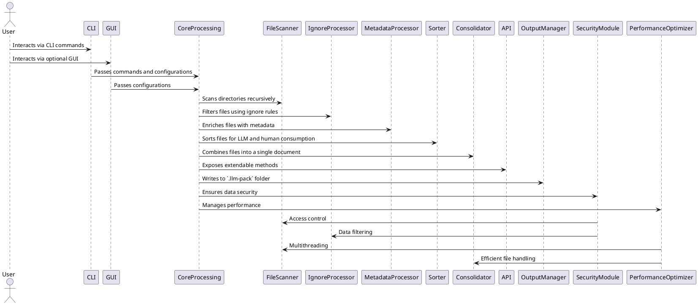

---

= SPEC: LLM-Pack
:sectnums:
:toc:

== Background

As developers and LLM users increasingly rely on generative AI tools to assist in development, creating concise, comprehensive, and contextually rich data inputs becomes critical. Many large language models (LLMs) operate in environments where users cannot upload large datasets or numerous files directly. Instead, users must copy and paste relevant content manually, which is time-consuming, error-prone, and often results in loss of critical context.

LLM-Pack is a CLI tool, with an optional GUI launched from the CLI, designed to address this challenge. It optimizes project files and datasets for consumption by LLMs and humans alike. By consolidating content into a single, labeled, and sorted file with metadata and interconnectivity details, LLM-Pack streamlines workflows, enhances LLM responses, and saves time for developers.

The tool respects existing project structure by adhering to ignore files, applies user-configured settings via `.llm-pack.config.json`, and outputs a `.llm-pack` folder with generated files and configurations. Its API-first design ensures high extendability and integrability across various platforms, fostering a robust ecosystem around the tool.

== Requirements

The LLM-Pack application must meet the following requirements to address the identified user needs effectively:

=== Must-Have

- **Recursive Indexing**: The tool must scan the entire project/dataset folder structure recursively, identifying all files and folders.
- **Ignore File Compliance**: Respect ignore files (`.gitignore`, `.llm-pack.ignore`, etc.) in the root or child directories during indexing.
- **File Consolidation**: Combine all non-ignored files into a single output file with:
  - Stylized headers containing file name, relative path, and metadata.
  - Relevant interconnectivity details for LLM optimization.
- **Sorting Mechanism**: Sort files in a manner optimized for both LLMs and humans.
- **Config File Support**: Parse `.llm-pack.config.json` files to customize the behavior and settings of the tool.
- **.llm-pack Folder Generation**: Output the consolidated file and associated configurations to the `.llm-pack` folder in the root directory.
- **CLI with Optional GUI**: Provide a command-line interface with an optional GUI for ease of use.
- **Extendable API**: Include a comprehensive API that allows easy integration with other systems or applications.
- **Security Compliance**: Ensure that sensitive data is handled securely and that the tool does not expose or leak confidential information.
- **Performance Efficiency**: Optimize the tool to handle large projects with minimal memory and CPU usage.

=== Should-Have

- **Metadata Enrichment**: Automatically generate additional metadata for files, such as descriptions or relationships, where applicable.
- **Interactive Mode**: Offer an interactive CLI mode for advanced configuration during execution.
- **Error Handling and Reporting**: Include robust error detection, logging, and user-friendly reporting.
- **Internationalization (i18n)**: Support multiple languages for the GUI and CLI to cater to a global user base.

=== Could-Have

- **Content Analysis**: Analyze file content for additional sorting and organization strategies (e.g., detecting similar themes or topics).
- **Language Agnostic**: Ensure compatibility with any file or folder structure regardless of content type or language.
- **GUI Customizations**: Allow GUI users to modify settings visually before execution.
- **Plugin System**: Enable third-party plugins to extend the functionality of LLM-Pack.

=== Won’t-Have (for MVP)

- **Cloud Integration**: Direct integration with cloud services (e.g., S3, GDrive) is deferred for future versions.
- **Real-Time Syncing**: Automatic syncing with external datasets or repositories is out of scope for the initial implementation.
- **Workers and Web Workers**: Worker threads, including Web Workers for concurrency, will not be supported in the MVP version.

== Method

The architecture of LLM-Pack is designed to be modular, scalable, and extendable, with clear separation of concerns between its core functionalities. The following sections outline the major components and their interactions.

=== High-Level Architecture

The application consists of the following layers:
1. **CLI and GUI Layer**: Provides user interaction and configuration.
2. **Core Processing Layer**: Handles file scanning, ignore file compliance, metadata enrichment, and consolidation logic.
3. **API Layer**: Exposes extendable functionality for integrations.
4. **Output Layer**: Generates the `.llm-pack` folder and consolidated file.
5. **Security Layer**: Ensures secure handling of data and compliance with data protection standards.
6. **Performance Optimization Layer**: Manages performance-related aspects like multithreading and resource management.

Below is a high-level diagram of the architecture:



=== Key Modules

1. **File Scanner**
   - Recursively scans the root directory and subdirectories.
   - Gathers all file paths and metadata for processing.
   - Supports multithreaded scanning for performance optimization.

2. **Ignore Processor**
   - Parses `.gitignore`, `.llm-pack.ignore`, and other ignore files.
   - Filters out files and folders based on ignore rules.

3. **Metadata Processor**
   - Enriches each file with:
     - Relative path from the root.
     - Stylized headers with file names.
     - Interconnectivity details based on file relationships (e.g., imports, references).

4. **Sorter**
   - Implements sorting logic to arrange files in a meaningful order for both humans and LLMs.

5. **Consolidator**
   - Reads content from each file.
   - Applies stylized headers and integrates metadata.
   - Outputs a single file in **Markdown format** containing consolidated data.

6. **Config Processor**
   - Parses `.llm-pack.config.json` to customize application behavior.
   - Allows users to override default sorting, metadata, or file-processing rules.

7. **API**
   - Offers programmatic access to file indexing, metadata enrichment, and consolidation.
   - Supports integrations with external systems.

8. **GUI**
   - A lightweight interface launched from the CLI.
   - Provides visual customization of settings and triggers CLI commands.
   - **UI/UX Design**:
     - **Configuration Panel**: Allows users to adjust settings visually.
     - **File Preview Pane**: Shows previews of scanned files.
     - **Log Viewer**: Displays logs and errors.
     - **Progress Indicators**: Visual feedback during processing.

9. **Security Module**
   - Ensures secure handling of data.
   - Implements data encryption for sensitive information.
   - Enforces access controls and permissions.

10. **Performance Optimizer**
    - Manages multithreading and resource allocation.
    - Optimizes memory and CPU usage for large projects.

=== File Structure

- **Input**: The tool expects to be run in the root directory of the project or dataset.
- **Output**: All results are stored in a `.llm-pack` folder with the following structure:
  ```
  .llm-pack/
  ├── consolidated_output.md    # Single consolidated Markdown file
  ├── config.json               # Copy of .llm-pack.config.json with defaults
  ├── logs/                     # Logs for error handling and debugging
  │   ├── error.log
  │   └── access.log
  └── reports/                  # Reports on processing and performance
      └── summary_report.md
  ```

=== Algorithms

1. **Recursive File Scanning Algorithm**
   - Traverse directories using a Depth-First Search (DFS) or Breadth-First Search (BFS).
   - Skip ignored files and directories during traversal.

2. **File Consolidation Algorithm**
   - For each non-ignored file:
     1. Add a stylized header containing metadata.
     2. Append file content below the header in Markdown format.
   - Sort the files based on LLM optimization logic.

3. **Metadata Enrichment Logic**
   - Extract relationships using simple heuristics (e.g., `import` statements, file references).

=== Security Considerations

Ensuring the security and privacy of data processed by LLM-Pack is paramount. The following measures are implemented:

- **Data Privacy**: The tool does not transmit any data externally. All processing occurs locally on the user's machine.
- **Sensitive Data Handling**: Implements encryption for any sensitive metadata or content included in the consolidated output.
- **Access Controls**: Restricts access to the `.llm-pack` folder to authorized users only.
- **Dependency Security**: Regularly scans and updates dependencies to mitigate vulnerabilities using tools like `npm audit`.

=== Performance Considerations

LLM-Pack is optimized to handle large projects efficiently. Key performance strategies include:

- **Multithreading**: Utilizes multithreading in the File Scanner to expedite directory traversal.
- **Efficient I/O Operations**: Implements buffered I/O to reduce read/write times during file consolidation.
- **Memory Management**: Employs streaming techniques to handle large files without excessive memory consumption.
- **Benchmarking**: Establishes performance benchmarks to ensure processing times remain within acceptable limits.

=== Dependency Management

Effective dependency management ensures the stability and security of LLM-Pack. Strategies include:

- **Version Pinning**: Specifies exact versions of dependencies in `package.json` to prevent unexpected updates.
- **Regular Updates**: Periodically updates dependencies to incorporate security patches and feature enhancements.
- **Vulnerability Scanning**: Integrates tools like `npm audit` to detect and address vulnerabilities.
- **Minimal Dependencies**: Keeps the dependency list minimal to reduce potential security risks and maintenance overhead.

=== Licensing

LLM-Pack will be released under the **MIT License**, providing users with flexibility while protecting the project's integrity. The `LICENSE` file in the project root will contain the full license text.

== Method

The architecture of LLM-Pack is designed to be modular, scalable, and extendable, with clear separation of concerns between its core functionalities. The following sections outline the major components and their interactions.

=== High-Level Architecture

The application consists of the following layers:
1. **CLI and GUI Layer**: Provides user interaction and configuration.
2. **Core Processing Layer**: Handles file scanning, ignore file compliance, metadata enrichment, and consolidation logic.
3. **API Layer**: Exposes extendable functionality for integrations.
4. **Output Layer**: Generates the `.llm-pack` folder and consolidated file.
5. **Security Layer**: Ensures secure handling of data and compliance with data protection standards.
6. **Performance Optimization Layer**: Manages performance-related aspects like multithreading and resource management.

Below is a high-level diagram of the architecture:


=== Key Modules

1. **File Scanner**
   - Recursively scans the root directory and subdirectories.
   - Gathers all file paths and metadata for processing.
   - Supports multithreaded scanning for performance optimization.
   - **Features**:
     - Depth-First Search (DFS) and Breadth-First Search (BFS) algorithms.
     - Concurrent processing for large directories.
   - **Requirements**:
     - Access to Node.js `fs` module.
     - Integration with Performance Optimizer for multithreading.

2. **Ignore Processor**
   - Parses `.gitignore`, `.llm-pack.ignore`, and other ignore files.
   - Filters out files and folders based on ignore rules.
   - **Features**:
     - Reads multiple ignore file formats.
     - Applies ignore patterns recursively.
   - **Requirements**:
     - `ignore` npm package or equivalent.
     - Efficient pattern matching algorithms.

3. **Metadata Processor**
   - Enriches each file with:
     - Relative path from the root.
     - Stylized headers with file names.
     - Interconnectivity details based on file relationships (e.g., imports, references).
   - **Features**:
     - Extracts dependencies and references.
     - Generates descriptive metadata.
   - **Requirements**:
     - Content parsing for metadata extraction (e.g., regex for `import` statements).
     - Integration with Sorter for relationship-based sorting.

4. **Sorter**
   - Implements sorting logic to arrange files in a meaningful order for both humans and LLMs.
   - **Features**:
     - Rule-based sorting algorithms.
     - Prioritizes entry-point files.
     - Supports custom sorting rules via configuration.
   - **Requirements**:
     - Configurable sorting rules.
     - Integration with Metadata Processor for informed sorting.

5. **Consolidator**
   - Reads content from each file.
   - Applies stylized headers and integrates metadata.
   - Outputs a single file in **Markdown format** containing consolidated data.
   - **Features**:
     - Reads and writes files efficiently using streams.
     - Ensures proper Markdown formatting.
   - **Requirements**:
     - Access to metadata processor and sorted file list.
     - Integration with Performance Optimizer for efficient file handling.

6. **Config Processor**
   - Parses `.llm-pack.config.json` to customize application behavior.
   - Allows users to override default sorting, metadata, or file-processing rules.
   - **Features**:
     - Loads and validates configuration settings.
     - Applies user-defined settings.
   - **Requirements**:
     - JSON parsing support.
     - Error handling for invalid configurations.

7. **API**
   - Offers programmatic access to file indexing, metadata enrichment, and consolidation.
   - Supports integrations with external systems.
   - **Features**:
     - Methods for indexing, metadata enrichment, and consolidation.
     - RESTful API endpoints.
     - Detailed API documentation.
   - **Requirements**:
     - Full access to core modules.
     - Security measures for API access (e.g., API keys).

8. **GUI**
   - A lightweight interface launched from the CLI.
   - Provides visual customization of settings and triggers CLI commands.
   - **UI/UX Design**:
     - **Configuration Panel**: Allows users to adjust settings visually.
     - **File Preview Pane**: Shows previews of scanned files.
     - **Log Viewer**: Displays logs and errors.
     - **Progress Indicators**: Visual feedback during processing.
   - **Features**:
     - Renders GUI for user configuration and execution.
     - Handles user interactions for running the tool visually.
   - **Requirements**:
     - Framework: Electron.js (or similar lightweight desktop app framework).
     - Access to core modules for running logic.

9. **Security Module**
   - Ensures secure handling of data.
   - Implements data encryption for sensitive information.
   - Enforces access controls and permissions.
   - **Features**:
     - Data encryption and decryption mechanisms.
     - Access control policies.
   - **Requirements**:
     - Integration with FileScanner and IgnoreProcessor for data protection.
     - Compliance with data protection standards (e.g., GDPR).

10. **Performance Optimizer**
    - Manages multithreading and resource allocation.
    - Optimizes memory and CPU usage for large projects.
    - **Features**:
      - Efficient scheduling of threads.
      - Resource monitoring and management.
    - **Requirements**:
      - Integration with FileScanner and Consolidator.
      - Performance benchmarking tools.

=== File Structure

- **Input**: The tool expects to be run in the root directory of the project or dataset.
- **Output**: All results are stored in a `.llm-pack` folder with the following structure:
  ```
  .llm-pack/
  ├── consolidated_output.md    # Single consolidated Markdown file
  ├── config.json               # Copy of .llm-pack.config.json with defaults
  ├── logs/                     # Logs for error handling and debugging
  │   ├── error.log
  │   └── access.log
  └── reports/                  # Reports on processing and performance
      └── summary_report.md
  ```

=== Algorithms

1. **Recursive File Scanning Algorithm**
   - Traverse directories using a Depth-First Search (DFS) or Breadth-First Search (BFS).
   - Skip ignored files and directories during traversal.

2. **File Consolidation Algorithm**
   - For each non-ignored file:
     1. Add a stylized header containing metadata.
     2. Append file content below the header in Markdown format.
   - Sort the files based on LLM optimization logic.

3. **Metadata Enrichment Logic**
   - Extract relationships using simple heuristics (e.g., `import` statements, file references).

=== Project File List

Below is the comprehensive list of all files required to build the project, including short descriptions, their contained features/methods, and any specific requirements.

```
src/
├── index.js
│   - Entry point of the application. Initializes CLI and GUI.
│   - Features:
│       - Command-line argument parsing.
│       - GUI initialization logic.
│   - Requirements:
│       - Access to CLI parser and GUI launcher modules.
│
├── cli/
│   ├── cli.js
│   │   - CLI interface logic.
│   │   - Features:
│   │       - Processes CLI arguments.
│   │       - Triggers core methods based on user input.
│   │   - Requirements:
│   │       - Core processing modules (scanner, consolidator, sorter).
│   │
│   └── interactive.js
│       - Interactive CLI mode logic.
│       - Features:
│           - Prompts users for inputs interactively.
│           - Displays options for customization.
│       - Requirements:
│           - Access to core modules and configuration processor.
│
├── gui/
│   ├── gui.js
│   │   - GUI entry point.
│   │   - Features:
│   │       - Renders GUI for user configuration and execution.
│   │       - Handles user interactions for running the tool visually.
│   │       - **UI/UX Design**:
│   │           - Configuration Panel
│   │           - File Preview Pane
│   │           - Log Viewer
│   │           - Progress Indicators
│   │   - Requirements:
│   │       - Framework: Electron.js (or similar lightweight desktop app framework).
│   │       - Access to core modules for running logic.
│   │
│   ├── components/
│   │   ├── configEditor.js
│   │   │   - Component for editing configurations via GUI.
│   │   ├── filePreview.js
│   │   │   - Displays previews of scanned files in GUI.
│   │   └── logViewer.js
│   │       - Displays logs and errors in GUI.
│   │
├── core/
│   ├── fileScanner.js
│   │   - Recursively scans project directories.
│   │   - Features:
│   │       - Depth-First Search (DFS) algorithm.
│   │       - Multithreading for large directories.
│   │   - Requirements:
│   │       - Access to Node.js `fs` module.
│   │       - Integration with Performance Optimizer.
│   │
│   ├── ignoreProcessor.js
│   │   - Processes ignore rules.
│   │   - Features:
│   │       - Parses `.gitignore` and `.llm-pack.ignore`.
│   │       - Filters ignored files and folders.
│   │   - Requirements:
│   │       - `ignore` npm package.
│   │
│   ├── metadataProcessor.js
│   │   - Adds metadata to files.
│   │   - Features:
│   │       - Extracts relative paths, descriptions, and interconnectivity.
│   │   - Requirements:
│   │       - Content parsing for metadata extraction (e.g., regex for `import` statements).
│   │
│   ├── consolidator.js
│   │   - Consolidates files into a single Markdown document.
│   │   - Features:
│   │       - Stylized headers with metadata.
│   │       - Appends file content below headers.
│   │       - Uses Node.js streams for performance.
│   │   - Requirements:
│   │       - Access to metadata processor and sorted file list.
│   │
│   ├── sorter.js
│   │   - Sorts files for LLM optimization.
│   │   - Features:
│   │       - Rule-based sorting algorithms.
│   │       - Prioritizes entry-point files.
│   │       - Supports custom sorting rules via configuration.
│   │   - Requirements:
│   │       - Configurable sorting rules.
│   │
│   └── configProcessor.js
│       - Processes `.llm-pack.config.json`.
│       - Features:
│           - Loads and validates configuration.
│           - Applies user-defined settings.
│       - Requirements:
│           - JSON parsing support.
│           - Error handling for invalid configurations.
│
├── api/
│   ├── api.js
│   │   - Exposes programmatic access to LLM-Pack functionality.
│   │   - Features:
│   │       - Methods for indexing, metadata enrichment, and consolidation.
│   │       - RESTful API endpoints.
│   │   - Requirements:
│   │       - Full access to core modules.
│   │       - Security measures for API access (e.g., API keys).
│   │
│   └── docs/
│       ├── api_reference.md
│       │   - Documentation for the API endpoints.
│       │   - **Includes**:
│       │       - Endpoint descriptions.
│       │       - Request and response formats.
│       │       - Authentication methods.
│       └── usage_examples.md
│           - Code examples for API integration.
│
├── output/
│   ├── outputManager.js
│   │   - Manages the `.llm-pack` folder and its contents.
│   │   - Features:
│   │       - Writes consolidated file in Markdown format.
│   │       - Generates logs and configuration snapshots.
│   │       - Creates summary reports on processing and performance.
│   │   - Requirements:
│   │       - File write access to the project directory.
│   │
├── utils/
│   ├── logger.js
│   │   - Logging utility.
│   │   - Features:
│   │       - Outputs logs for debugging and error tracking.
│   │       - Supports different log levels (info, warning, error).
│   │
│   └── helpers.js
│       - Miscellaneous helper functions.
│       - Features:
│           - Utility functions for common tasks.
│           - Data validation and formatting helpers.
│
├── tests/
│   ├── unit/
│   │   ├── fileScanner.test.js
│   │   ├── ignoreProcessor.test.js
│   │   ├── metadataProcessor.test.js
│   │   ├── sorter.test.js
│   │   └── consolidator.test.js
│   ├── integration/
│   │   ├── cliIntegration.test.js
│   │   ├── guiIntegration.test.js
│   │   └── apiIntegration.test.js
│   │
│   └── mocks/
│       ├── mockFileSystem.js
│       └── mockConfig.json
│       - Features:
│           - Mock file systems for testing.
│           - Sample configuration files for testing purposes.
│   - Features:
│       - Tests for each module, mock file systems for testing.
│   - Requirements:
│       - `Jest` or `Mocha` testing framework.
│
├── docs/
│   ├── user_guide.md
│   │   - Comprehensive guide for end-users.
│   │   - **Includes**:
│   │       - Installation instructions.
│   │       - CLI usage examples.
│   │       - GUI walkthrough.
│   │       - Troubleshooting tips.
│   ├── developer_guide.md
│   │   - Guide for developers contributing to the project.
│   │   - **Includes**:
│   │       - Codebase overview.
│   │       - Contribution guidelines.
│   │       - Coding standards.
│   ├── api/
│   │   ├── api_reference.md
│   │   │   - Documentation for the API endpoints.
│   │   └── usage_examples.md
│   │       - Code examples for API integration.
│   └── architecture_diagram.png
│       - Visual representation of the system architecture.
│
├── package.json
│   - Defines project dependencies and scripts.
│   - Features:
│       - Dependencies management, CLI and build scripts.
│       - Scripts for testing, building, and deploying.
│   - Requirements:
│       - Required for npm.
│
├── .gitignore
│   - Excludes unnecessary files from version control.
│   - Features:
│       - Standard ignore rules.
│
├── .llm-pack.ignore
│   - Custom ignore file for LLM-Pack operations.
│   - Features:
│       - User-defined file and folder exclusions.
│
├── README.md
│   - Main project readme for user introduction and installation instructions.
│   - Features:
│       - Overview, installation, usage examples.
│       - Links to detailed documentation.
│
├── LICENSE
│   - Licensing information for the project.
│   - Features:
│       - Full text of the MIT License.
│
└── CONTRIBUTING.md
    - Guidelines for contributing to the project.
    - Features:
    │   - Code of conduct.
    │   - Contribution process.
    │   - Development setup instructions.
```

=== Example Consolidated File Output

Below is an example snippet of a consolidated Markdown file:

```markdown
# main.js
**Path**: /src/main.js
**Metadata**: Entry point of the application
---
```javascript
console.log('Hello, World!');
```
---
# utils.js
**Path**: /src/helpers/utils.js
**Metadata**: Contains utility functions
---
```javascript
export const add = (a, b) => a + b;
```
```

== Implementation

This section provides a step-by-step implementation plan for LLM-Pack, including a comprehensive project file list.

=== Steps to Build

1. **Setup Project Structure**
   - Initialize the project with a directory structure for core modules, configuration, and output.
   - Use Node.js as the primary backend with ES modules (ECMAScript) for better modularity.

2. **Develop Core Modules**
   - Build each module incrementally, starting with FileScanner and IgnoreProcessor.
   - Implement the Security Module to handle data protection from the outset.

3. **Implement CLI**
   - Use a library like `commander` to create an intuitive command-line interface.
   - Ensure CLI supports both standard and interactive modes.

4. **Create Optional GUI**
   - Use a lightweight JavaScript framework (e.g., Electron or Tauri) to develop the GUI launched from the CLI.
   - Design the GUI with user-friendly components and clear navigation.

5. **Design and Expose API**
   - Provide well-documented APIs using tools like Swagger or Postman.
   - Ensure API endpoints are secure and efficiently handle requests.

6. **Integrate Security Measures**
   - Implement data encryption for sensitive information.
   - Set up access controls and authentication mechanisms for the API.

7. **Optimize Performance**
   - Implement multithreading in the File Scanner.
   - Optimize I/O operations in the Consolidator.
   - Conduct performance benchmarking and make necessary adjustments.

8. **Test and Debug**
   - Write unit and integration tests for each module.
   - Use Jest or Mocha for testing the Node.js backend.
   - Incorporate continuous integration (CI) tools for automated testing.

9. **Finalize Output Formatting**
   - Implement Markdown formatting for the consolidated output.
   - Ensure headers, metadata, and file contents are visually clear.

10. **Handle Dependency Management**
    - Pin dependency versions in `package.json`.
    - Set up automated dependency updates and vulnerability scanning.

11. **Documentation and Licensing**
    - Complete user and developer documentation in the `docs/` directory.
    - Add licensing information in the `LICENSE` file.

12. **Package and Distribute**
    - Create an npm package for easy installation.
    - Include comprehensive documentation for users and developers.
    - Bundle the GUI as an optional standalone installer.

13. **Deploy and Monitor**
    - Release version 1.0.0 on GitHub and npm.
    - Monitor for any issues and gather user feedback.

=== Project File List

Below is the list of all the files required for the project, along with descriptions, features, methods, and each file's requirements:

| **File**                | **Description**                                                                 | **Features and Methods**                                         | **Dependencies/Requirements**               |
|-------------------------|---------------------------------------------------------------------------------|-------------------------------------------------------------------|---------------------------------------------|
| `index.js`              | Entry point for the CLI and orchestrator.                                        | CLI command parser, orchestrator for core modules.               | Requires all core modules.                  |
| `cli.js`                | Handles user input and command-line interface.                                  | Parses arguments, calls appropriate functions.                   | `commander` or equivalent CLI library.      |
| `interactive.js`        | Manages interactive CLI mode.                                                   | Prompts user for inputs, configures settings interactively.      | `inquirer` or similar library.              |
| `gui.js`                | Launches the optional GUI interface.                                            | Initializes GUI, connects to core modules.                       | Electron or Tauri setup.                    |
| `fileScanner.js`        | Recursively scans the directory for files and folders.                          | DFS/BFS algorithms, returns file list and metadata.              | Core Node.js filesystem (`fs`) module.      |
| `ignoreProcessor.js`    | Parses ignore files and filters out excluded files.                             | Reads `.gitignore`, `.llm-pack.ignore`, and similar files.        | `ignore` npm package.                       |
| `metadataProcessor.js`  | Enriches files with metadata and interconnectivity details.                     | Extracts paths, relationships, and descriptions.                 | Regex parsers for relationship detection.   |
| `sorter.js`             | Sorts files for human and LLM readability.                                      | Implements custom sorting algorithms.                            | Internal dependencies (MetadataProcessor).  |
| `consolidator.js`       | Combines files into a single Markdown document with stylized headers.           | Reads files, applies formatting, writes to output.               | Uses Node.js streams for performance.       |
| `configProcessor.js`    | Parses `.llm-pack.config.json` to customize app behavior.                       | Reads and validates configuration settings.                      | JSON parser, error handling.                |
| `api.js`                | Exposes programmatic access to LLM-Pack functionality.                          | Methods for indexing, metadata enrichment, and consolidation.    | Full access to core modules.                |
| `outputManager.js`      | Manages `.llm-pack` folder creation and writes consolidated output.             | Handles file output operations, ensures consistency.             | Node.js `fs` module.                        |
| `logger.js`             | Logging utility.                                                                | Outputs logs for debugging and error tracking.                   | `winston` or similar logging library.       |
| `helpers.js`            | Miscellaneous helper functions.                                                 | Utility functions for common tasks.                              | None.                                       |
| `unit/*.test.js`        | Unit tests for individual modules.                                              | Tests for each core module.                                      | `Jest` or `Mocha` testing framework.        |
| `integration/*.test.js` | Integration tests for combined modules and workflows.                           | Tests CLI, GUI, and API integrations.                            | `Jest` or `Mocha` testing framework.        |
| `mocks/*.js`            | Mock data and configurations for testing.                                      | Mock file systems, sample configurations.                        | `mock-fs` or similar library.               |
| `user_guide.md`         | Comprehensive guide for end-users.                                              | Installation, CLI and GUI usage, troubleshooting.                | Markdown formatting.                        |
| `developer_guide.md`    | Guide for developers contributing to the project.                              | Codebase overview, contribution guidelines, coding standards.    | Markdown formatting.                        |
| `api_reference.md`      | Documentation for the API endpoints.                                           | Endpoint descriptions, request and response formats.             | Markdown formatting, Swagger integration.   |
| `usage_examples.md`     | Code examples for API integration.                                             | Sample code snippets and usage scenarios.                        | Markdown formatting.                        |
| `architecture_diagram.png` | Visual representation of the system architecture.                           | High-level architecture diagram.                                 | Diagram creation tool (e.g., PlantUML).     |
| `package.json`          | Defines project dependencies and scripts.                                       | Dependencies management, CLI and build scripts.                  | Required for npm.                           |
| `.gitignore`            | Excludes unnecessary files from version control.                                | Standard ignore rules.                                           | None.                                       |
| `.llm-pack.ignore`      | Custom ignore file for LLM-Pack operations.                                     | User-defined file and folder exclusions.                         | None.                                       |
| `README.md`             | Main project readme for user introduction and installation instructions.         | Overview, installation, usage examples, links to docs.           | None.                                       |
| `LICENSE`               | Licensing information for the project.                                         | Full text of the MIT License.                                    | None.                                       |
| `CONTRIBUTING.md`       | Guidelines for contributing to the project.                                    | Code of conduct, contribution process, development setup.        | Markdown formatting.                        |
```

=== Development Workflow

1. **Module Implementation Order**
   - Start with `FileScanner.js` and `IgnoreProcessor.js` as foundational modules.
   - Build `MetadataProcessor.js`, `Sorter.js`, and `Consolidator.js` sequentially.
   - Implement `SecurityModule.js` early to integrate security measures from the start.

2. **Testing Strategy**
   - Write unit tests for each module during development.
   - Develop integration tests for combined workflows.
   - Use continuous integration (CI) to automate testing processes.

3. **Dependency Management**
   - Pin dependency versions in `package.json`.
   - Set up automated tools for dependency updates and vulnerability scanning.

4. **Packaging**
   - Use npm to bundle the application for distribution.
   - Include a pre-launch script to validate configurations.

5. **Documentation**
   - Provide detailed documentation for CLI commands, API usage, and GUI interface.
   - Maintain up-to-date user and developer guides in the `docs/` directory.

6. **Build and Deployment Pipeline**
   - Set up CI/CD pipelines using tools like GitHub Actions or Travis CI.
   - Automate testing, building, and deployment processes.
   - Ensure that builds pass all tests before deployment.

7. **Licensing and Contribution Guidelines**
   - Finalize the `LICENSE` and `CONTRIBUTING.md` files.
   - Ensure that all contributors adhere to the code of conduct and contribution process.

8. **Finalize Output Formatting**
   - Implement Markdown formatting for the consolidated output.
   - Ensure headers, metadata, and file contents are visually clear.

9. **Performance Optimization**
   - Optimize multithreading and resource management based on benchmarking results.
   - Address any performance bottlenecks identified during testing.

10. **Security Audits**
    - Conduct security audits to identify and fix vulnerabilities.
    - Ensure compliance with data protection standards.

11. **Finalize and Release**
    - Conduct final testing and debugging.
    - Prepare release notes and documentation.
    - Release version 1.0.0 on GitHub and npm.

=== Roadmap for Future Enhancements

While the current specification focuses on the MVP, the following features are planned for future releases:

- **Cloud Integration**: Support for direct integration with cloud services like AWS S3 and Google Drive.
- **Real-Time Syncing**: Enable automatic syncing with external datasets or repositories.
- **Advanced Content Analysis**: Implement machine learning algorithms for deeper content analysis and organization.
- **Plugin System**: Allow third-party developers to create plugins to extend LLM-Pack’s functionality.
- **Enhanced GUI Features**: Introduce more customization options and advanced visualization tools.
- **Localization**: Support multiple languages in the GUI and CLI.
- **Mobile Support**: Develop mobile-friendly interfaces or companion apps.

== Milestones

The development of LLM-Pack will be divided into the following milestones to ensure incremental progress and iterative validation:

=== Milestone 1: Project Initialization
- **Deliverables**:
  - Set up the project structure, including directories for core modules, tests, and documentation.
  - Initialize `package.json` with project metadata and dependencies.
  - Create a `.gitignore` file and a sample `.llm-pack.ignore`.
  - Write a basic `README.md` with project overview and goals.
  - Add `LICENSE` and `CONTRIBUTING.md` files.
- **Estimated Completion**: Week 1

=== Milestone 2: Core Module Development - File Handling
- **Deliverables**:
  - Implement `FileScanner.js` for recursive file scanning.
  - Implement `IgnoreProcessor.js` for parsing and applying ignore rules.
  - Write unit tests for `FileScanner.js` and `IgnoreProcessor.js`.
  - Integrate `PerformanceOptimizer` with `FileScanner.js`.
- **Estimated Completion**: Week 2

=== Milestone 3: Metadata and Sorting Logic
- **Deliverables**:
  - Implement `MetadataProcessor.js` for metadata enrichment and interconnectivity detection.
  - Implement `Sorter.js` for sorting files based on LLM and human optimization logic.
  - Write unit tests for `MetadataProcessor.js` and `Sorter.js`.
- **Estimated Completion**: Week 4

=== Milestone 4: File Consolidation and Output
- **Deliverables**:
  - Implement `Consolidator.js` for combining files into a single Markdown document.
  - Implement `OutputManager.js` to handle `.llm-pack` folder creation and write outputs.
  - Write integration tests for the full consolidation workflow.
- **Estimated Completion**: Week 6

=== Milestone 5: Configuration and Extendability
- **Deliverables**:
  - Implement `ConfigProcessor.js` to parse `.llm-pack.config.json`.
  - Expose the API layer for integration with external systems.
  - Write API documentation in the `docs/` directory.
  - Implement basic API security measures.
- **Estimated Completion**: Week 8

=== Milestone 6: CLI and GUI Development
- **Deliverables**:
  - Implement `cli.js` for the command-line interface using `commander`.
  - Develop `gui.js` using Electron or Tauri for optional GUI interface.
  - Design and implement GUI components (Configuration Panel, File Preview Pane, Log Viewer, Progress Indicators).
  - Write usage documentation for CLI and GUI in `README.md`.
- **Estimated Completion**: Week 10

=== Milestone 7: Testing and Documentation
- **Deliverables**:
  - Complete unit and integration tests for all modules.
  - Add mock datasets for testing the tool end-to-end.
  - Finalize user and developer documentation in the `docs/` directory.
  - Conduct security audits and address vulnerabilities.
- **Estimated Completion**: Week 12

=== Milestone 8: Packaging and Distribution
- **Deliverables**:
  - Package the CLI tool for npm distribution.
  - Bundle the GUI as an optional standalone installer.
  - Release version 1.0.0 on GitHub and npm.
  - Set up CI/CD pipelines for automated testing and deployment.
- **Estimated Completion**: Week 14

=== Milestone 9: Feedback and Post-Launch Updates
- **Deliverables**:
  - Gather user feedback from early adopters.
  - Address critical bugs and improve documentation.
  - Plan for additional features based on user feedback.
  - Begin work on roadmap features like cloud integration.
- **Estimated Completion**: Week 16

== Gathering Results

To determine the success of LLM-Pack and its adherence to the specified requirements, the following evaluation steps will be performed:

=== Evaluation Metrics
1. **Functional Validation**:
   - Ensure all core features, such as recursive indexing, ignore file compliance, metadata enrichment, and output consolidation, work as intended.
   - Validate the accuracy and formatting of the Markdown output.

2. **Performance Metrics**:
   - Measure the time taken to process large datasets with different levels of complexity.
   - Assess memory and CPU usage during execution.
   - Ensure performance benchmarks are met as per the Performance Considerations.

3. **User Feedback**:
   - Gather feedback from developers and LLM users on usability, performance, and output quality.
   - Evaluate the adoption and integration of the API in external systems.

4. **Error Handling**:
   - Confirm robust error reporting and logging for all edge cases.
   - Ensure that logs provide sufficient detail for debugging.

5. **Security Audits**:
   - Verify that all security measures are effectively protecting data.
   - Ensure compliance with data protection standards (e.g., GDPR).

6. **API Usage**:
   - Monitor the usage and performance of the API endpoints.
   - Ensure that API documentation is clear and comprehensive.

=== Post-Production Updates
- Address issues identified during user testing.
- Incorporate user-requested features and enhancements.
- Plan for future releases with advanced features like real-time syncing and cloud integration.
- Continuously monitor and update dependencies to maintain security and performance.

=== Roadmap Evaluation
- Regularly assess progress against the roadmap for future enhancements.
- Prioritize roadmap features based on user demand and feasibility.


---
title: LLM-Pack Standards
author: Development Team
date: 2024-04-27
---

= LLM-Pack Standards
:sectnums:
:toc:

== Introduction

This document outlines the **LLM-Pack Standards**, which provide explicit guidelines for coding, documentation, styling, and other development practices essential for the consistent and high-quality development of the LLM-Pack application. Adhering to these standards ensures code readability, maintainability, and facilitates collaboration among all contributors.

== Code Standards

Maintaining high-quality code is crucial for the scalability and maintainability of LLM-Pack. The following standards must be strictly followed by all contributors.

=== Programming Language and Environment

- **Language**: JavaScript (ES6+) with Node.js as the runtime environment.
- **Node.js Version**: 16.x or higher.
- **Package Manager**: npm (version 7.x or higher).

=== Naming Conventions

Consistent naming conventions enhance code readability and maintainability.

- **Variables and Functions**:
  - Use `camelCase` for variable and function names.
    ```javascript
    // Good
    const fileScanner = new FileScanner();
    function getMetadata() { /* ... */ }

    // Bad
    const File_Scanner = new FileScanner();
    function Get_Metadata() { /* ... */ }
    ```

- **Classes and Constructors**:
  - Use `PascalCase` for class names.
    ```javascript
    // Good
    class FileScanner { /* ... */ }

    // Bad
    class fileScanner { /* ... */ }
    ```

- **Constants**:
  - Use `UPPER_SNAKE_CASE` for constants.
    ```javascript
    // Good
    const MAX_RETRIES = 5;

    // Bad
    const maxRetries = 5;
    ```

- **Files and Directories**:
  - Use `kebab-case` for file and directory names.
    ```
    // Good
    file-scanner.js
    metadata-processor.js

    // Bad
    FileScanner.js
    metadataProcessor.js
    ```

=== Code Organization

Promote modularity and separation of concerns by organizing code effectively.

- **Modules**:
  - Each module should reside in its own file within the `src/` directory.
  - Modules should export a single responsibility to facilitate testing and reuse.
    ```javascript
    // file-scanner.js
    class FileScanner {
      constructor(rootDir) { /* ... */ }
      async scan() { /* ... */ }
    }

    module.exports = FileScanner;
    ```

- **Directory Structure**:
  - Follow the structure outlined in the [Design Specification](./design-spec.md).
    ```
    src/
    ├── cli/
    ├── core/
    ├── gui/
    ├── api/
    ├── output/
    ├── utils/
    └── tests/
    ```

=== Modularity

- **Single Responsibility Principle**:
  - Each module should have one, and only one, reason to change.

- **Encapsulation**:
  - Keep internal module details private.
  - Expose only necessary interfaces.
    ```javascript
    // Good
    class MetadataProcessor {
      constructor() { /* ... */ }
      async enrich(file) { /* ... */ }
    }

    module.exports = MetadataProcessor;
    ```

    ```javascript
    // Bad
    class MetadataProcessor {
      constructor() { /* ... */ }
      async enrich(file) { /* ... */ }
      _privateMethod() { /* ... */ }
    }

    module.exports = MetadataProcessor;
    ```

=== Error Handling

- **Try-Catch Blocks**:
  - Use `try-catch` blocks to handle synchronous and asynchronous errors.
    ```javascript
    async function processFile(file) {
      try {
        const data = await readFile(file);
        // Process data
      } catch (error) {
        logger.error(`Error processing file ${file}: ${error.message}`);
        throw new FileProcessingError(`Failed to process ${file}`);
      }
    }
    ```

- **Error Messages**:
  - Provide clear and descriptive error messages.
    ```javascript
    // Good
    throw new Error('Invalid configuration: Missing "rootDir" property.');

    // Bad
    throw new Error('Config error.');
    ```

- **Custom Errors**:
  - Create custom error classes for specific error types.
    ```javascript
    // file: errors/FileScannerError.js
    class FileScannerError extends Error {
      constructor(message) {
        super(message);
        this.name = 'FileScannerError';
      }
    }

    module.exports = FileScannerError;
    ```

    ```javascript
    // Usage
    const FileScannerError = require('./errors/FileScannerError');

    if (!config.rootDir) {
      throw new FileScannerError('Missing "rootDir" in configuration.');
    }
    ```

=== Asynchronous Code

- **Promises and Async/Await**:
  - Use `async/await` for asynchronous operations to improve readability.
    ```javascript
    // Good
    async function fetchData() {
      try {
        const response = await fetch('https://api.example.com/data');
        const data = await response.json();
        return data;
      } catch (error) {
        logger.error(error);
        throw error;
      }
    }
    ```

- **Avoid Callback Hell**:
  - Prefer Promises over nested callbacks to manage asynchronous flows.
    ```javascript
    // Good
    function readAndProcessFile(file) {
      return readFile(file)
        .then(data => processData(data))
        .catch(error => logger.error(error));
    }
    ```

    ```javascript
    // Bad
    function readAndProcessFile(file, callback) {
      readFile(file, (err, data) => {
        if (err) return callback(err);
        processData(data, (err, result) => {
          if (err) return callback(err);
          callback(null, result);
        });
      });
    }
    ```

=== Code Reviews

- **Peer Reviews**:
  - All code must undergo peer review before merging.

- **Review Criteria**:
  - Code correctness, readability, adherence to standards, performance, and security.

== Documentation Standards

Comprehensive documentation is essential for understanding and maintaining the project.

=== Inline Documentation

- **Comments**:
  - Use comments to explain complex logic and decisions.
  - Avoid redundant comments that do not add value.
    ```javascript
    // Good
    // Calculate the factorial of a number using recursion
    function factorial(n) {
      if (n === 0) return 1;
      return n * factorial(n - 1);
    }

    // Bad
    // This function calculates factorial
    function factorial(n) {
      // If n is zero, return 1
      if (n === 0) return 1;
      // Otherwise, return n times factorial of n-1
      return n * factorial(n - 1);
    }
    ```

- **JSDoc**:
  - Use JSDoc annotations for functions, classes, and modules.
    ```javascript
    /**
     * Scans directories recursively to gather file paths.
     * @class FileScanner
     */
    class FileScanner {
      /**
       * Initializes the FileScanner with the root directory.
       * @param {string} rootDir - The root directory to scan.
       */
      constructor(rootDir) {
        this.rootDir = rootDir;
      }

      /**
       * Starts the scanning process.
       * @returns {Promise<Array<string>>} - A promise that resolves to an array of file paths.
       */
      async scan() {
        // Implementation
      }
    }

    module.exports = FileScanner;
    ```

=== External Documentation

- **README.md**:
  - Provide an overview, installation instructions, usage examples, and links to detailed documentation.
    ```markdown
    # LLM-Pack

    LLM-Pack is a CLI tool with an optional GUI designed to optimize project files and datasets for consumption by Large Language Models (LLMs) and humans.

    ## Installation

    ```bash
    npm install -g llm-pack
    ```

    ## Usage

    ```bash
    llm-pack scan --config .llm-pack.config.json
    ```

    ## Documentation

    - [User Guide](./docs/user_guide.md)
    - [Developer Guide](./docs/developer_guide.md)
    - [API Reference](./docs/api/api_reference.md)
    ```

- **User Guide**:
  - Detailed instructions for end-users covering all features and functionalities.

- **Developer Guide**:
  - Instructions for developers, including codebase overview, contribution guidelines, and coding standards.

- **API Documentation**:
  - Comprehensive documentation of all API endpoints, including request/response formats and authentication methods.

=== Documentation Tools

- **Markdown**:
  - Use Markdown for all documentation files for consistency and ease of use.

- **Swagger/OpenAPI**:
  - Utilize Swagger or OpenAPI for API documentation to provide interactive and standardized API references.

- **PlantUML**:
  - Use PlantUML for creating architecture and sequence diagrams.

== Styling Guidelines

Consistent code styling enhances readability and reduces cognitive load.

=== Code Formatting

- **Indentation**:
  - Use 2 spaces for indentation. Do not use tabs.
    ```javascript
    // Good
    function example() {
      if (true) {
        console.log('Hello, World!');
      }
    }

    // Bad
    function example() {
        if (true) {
            console.log('Hello, World!');
        }
    }
    ```

- **Line Length**:
  - Limit lines to a maximum of 100 characters.

- **Semicolons**:
  - Use semicolons consistently to terminate statements.
    ```javascript
    // Good
    const a = 5;
    function test() { /* ... */ }

    // Bad
    const a = 5
    function test() { /* ... */ }
    ```

- **Quotes**:
  - Use single quotes `'` for strings unless double quotes `"` are necessary.
    ```javascript
    // Good
    const name = 'LLM-Pack';

    // Bad
    const name = "LLM-Pack";
    ```

- **Braces and Parentheses**:
  - Use braces `{}` for all control structures, even if the body contains a single statement.
    ```javascript
    // Good
    if (isValid) {
      execute();
    }

    // Bad
    if (isValid) execute();
    ```

- **Trailing Commas**:
  - Use trailing commas in multi-line object and array literals for easier diffs.
    ```javascript
    // Good
    const config = {
      rootDir: '/src',
      ignoreFiles: ['.gitignore', '.llm-pack.ignore'],
    };

    // Bad
    const config = {
      rootDir: '/src',
      ignoreFiles: ['.gitignore', '.llm-pack.ignore']
    };
    ```

=== Linting

- **ESLint**:
  - Use ESLint as the primary linting tool.
  - Adhere to the [Airbnb JavaScript Style Guide](https://github.com/airbnb/javascript).

- **Prettier**:
  - Integrate Prettier for automatic code formatting.
  - Configure ESLint to work seamlessly with Prettier.

- **Linting Scripts**:
  - Add linting scripts to `package.json`:
    ```json
    "scripts": {
      "lint": "eslint . --ext .js",
      "lint:fix": "eslint . --ext .js --fix",
      "prettier": "prettier --write ."
    }
    ```

=== Styling Enforcement

- **Pre-Commit Hooks**:
  - Use tools like `husky` and `lint-staged` to enforce linting and formatting before commits.
    ```bash
    # Install husky and lint-staged
    npm install --save-dev husky lint-staged

    # Add to package.json
    "husky": {
      "hooks": {
        "pre-commit": "lint-staged"
      }
    },
    "lint-staged": {
      "*.js": [
        "eslint --fix",
        "prettier --write"
      ]
    }
    ```

- **CI Integration**:
  - Integrate linting checks into the Continuous Integration (CI) pipeline to prevent non-compliant code from being merged.

== Testing Standards

Robust testing ensures the reliability and stability of the application.

=== Testing Framework

- **Jest**:
  - Use Jest as the primary testing framework for both unit and integration tests.

- **Setup**:
  - Configure Jest in `package.json`:
    ```json
    "scripts": {
      "test": "jest",
      "test:watch": "jest --watch",
      "test:coverage": "jest --coverage"
    },
    "jest": {
      "collectCoverage": true,
      "coverageDirectory": "coverage",
      "testEnvironment": "node"
    }
    ```

=== Unit Testing

- **Scope**:
  - Each module should have comprehensive unit tests covering all functionalities and edge cases.

- **Test Files**:
  - Name test files with the `.test.js` suffix.
    ```
    tests/
    ├── unit/
    │   ├── fileScanner.test.js
    │   ├── ignoreProcessor.test.js
    │   ├── metadataProcessor.test.js
    │   ├── sorter.test.js
    │   └── consolidator.test.js
    ```

- **Mocking**:
  - Use Jest's mocking capabilities to isolate modules and dependencies.
  - Utilize libraries like `mock-fs` for filesystem-related tests.
    ```javascript
    // fileScanner.test.js
    const mockFs = require('mock-fs');
    const FileScanner = require('../core/file-scanner');

    describe('FileScanner', () => {
      beforeEach(() => {
        mockFs({
          '/root': {
            'file1.js': 'console.log("file1");',
            'file2.js': 'console.log("file2");',
            'ignore.me': 'should be ignored',
            'subdir': {
              'file3.js': 'console.log("file3");'
            }
          }
        });
      });

      afterEach(() => {
        mockFs.restore();
      });

      test('should scan all non-ignored files', async () => {
        const scanner = new FileScanner('/root');
        const files = await scanner.scan();
        expect(files).toEqual([
          '/root/file1.js',
          '/root/file2.js',
          '/root/subdir/file3.js'
        ]);
      });
    });
    ```

=== Integration Testing

- **Scope**:
  - Test the interaction between multiple modules to ensure they work together as expected.

- **Test Files**:
  - Place integration tests in the `tests/integration/` directory.
    ```
    tests/
    ├── integration/
    │   ├── cliIntegration.test.js
    │   ├── guiIntegration.test.js
    │   └── apiIntegration.test.js
    ```

- **Environment**:
  - Use a controlled environment with mock data to simulate real-world scenarios.

=== Test Coverage

- **Coverage Threshold**:
  - Aim for at least 90% code coverage.

- **Coverage Reports**:
  - Generate coverage reports using Jest.
  - Include coverage badges in the `README.md`.
    ```markdown
    
    ```

- **Enforcement**:
  - Fail CI builds if coverage thresholds are not met.

=== Continuous Testing

- **CI Integration**:
  - Run tests automatically on each pull request and commit.

- **Automated Test Runs**:
  - Ensure that all tests pass before merging code into the main branch.

== Version Control Practices

Effective version control practices are essential for collaboration and project management.

=== Branching Strategy

- **Gitflow Model**:
  - Implement the Gitflow branching strategy to manage feature development, releases, and hotfixes.

- **Branch Types**:
  - **Master/Main**: Stable, production-ready code.
  - **Develop**: Integration branch for features.
  - **Feature Branches**: `feature/feature-name` for new features.
  - **Release Branches**: `release/version-number` for preparing releases.
  - **Hotfix Branches**: `hotfix/issue-number` for urgent fixes.

=== Commit Message Conventions

- **Format**:
  - Use the [Conventional Commits](https://www.conventionalcommits.org/en/v1.0.0/) specification.

- **Structure**:
  ```
  <type>[optional scope]: <description>

  [optional body]

  [optional footer(s)]
  ```

- **Types**:
  - `feat`: A new feature.
  - `fix`: A bug fix.
  - `docs`: Documentation only changes.
  - `style`: Changes that do not affect the meaning of the code.
  - `refactor`: A code change that neither fixes a bug nor adds a feature.
  - `test`: Adding missing or correcting existing tests.
  - `chore`: Changes to the build process or auxiliary tools and libraries.

- **Examples**:
  - `feat(cli): add interactive mode`
  - `fix(core): resolve file scanning issue`

=== Pull Requests

- **Naming**:
  - Use descriptive titles following the commit message conventions.

- **Description**:
  - Provide a clear and detailed description of the changes.
  - Reference related issues using `Closes #issue-number`.

- **Review Process**:
  - At least one peer review is required before merging.
  - Ensure that all tests pass and code is linted.

=== Tagging and Releases

- **Semantic Versioning**:
  - Follow [Semantic Versioning](https://semver.org/) for releases: `MAJOR.MINOR.PATCH`.

- **Release Notes**:
  - Generate release notes summarizing changes, new features, and bug fixes.

- **Automated Releases**:
  - Use tools like `semantic-release` to automate versioning and release processes based on commit messages.

== Dependency Management

Proper management of dependencies ensures project stability and security.

=== Managing Dependencies

- **Package Management**:
  - Use `npm` for managing project dependencies.

- **Dependency Types**:
  - **Dependencies**: Required for the application to run.
  - **DevDependencies**: Required only for development and testing.

- **Installation Commands**:
  - Use `npm install <package>` for dependencies.
  - Use `npm install --save-dev <package>` for devDependencies.

=== Version Pinning

- **Exact Versions**:
  - Pin dependency versions to exact versions in `package.json` to prevent unexpected updates.
    ```json
    "dependencies": {
      "commander": "9.4.1",
      "ignore": "5.1.8"
    }
    ```

=== Handling Vulnerabilities

- **Regular Audits**:
  - Run `npm audit` regularly to identify and fix vulnerabilities.

- **Automated Tools**:
  - Integrate security scanning tools in the CI pipeline.

- **Updating Dependencies**:
  - Promptly update dependencies when vulnerabilities are found.
  - Use tools like `npm-check-updates` to manage updates.

=== Minimal Dependencies

- **Avoid Bloat**:
  - Keep the number of dependencies minimal to reduce potential security risks and maintenance overhead.

- **Evaluate Necessity**:
  - Assess the necessity of each dependency before adding it to the project.

- **Favor Lightweight Libraries**:
  - Choose lightweight and well-maintained libraries over bulky alternatives.

== Security Standards

Ensuring the security of LLM-Pack protects both the application and its users.

=== Secure Coding Practices

- **Input Validation**:
  - Validate and sanitize all user inputs to prevent injection attacks.
    ```javascript
    function validateConfig(config) {
      if (typeof config.rootDir !== 'string') {
        throw new ValidationError('rootDir must be a string.');
      }
      // Additional validations
    }
    ```

- **Avoid Eval**:
  - Refrain from using `eval` or similar functions that execute arbitrary code.

- **Error Handling**:
  - Do not expose sensitive information in error messages.
    ```javascript
    // Good
    catch (error) {
      logger.error(`Error processing file: ${error.message}`);
      throw new FileProcessingError('Failed to process the file.');
    }

    // Bad
    catch (error) {
      throw new Error(error.stack);
    }
    ```

- **Dependencies**:
  - Use only trusted and well-maintained dependencies.

=== Data Handling

- **Sensitive Data**:
  - Encrypt sensitive data both in transit and at rest.
    ```javascript
    const crypto = require('crypto');

    function encrypt(data, key) {
      const cipher = crypto.createCipher('aes-256-cbc', key);
      let encrypted = cipher.update(data, 'utf8', 'hex');
      encrypted += cipher.final('hex');
      return encrypted;
    }
    ```

- **Data Privacy**:
  - Ensure that the tool does not transmit any data externally without explicit user consent.

- **Access Controls**:
  - Restrict access to sensitive data within the application.

=== Dependency Security

- **Regular Updates**:
  - Keep dependencies up-to-date with the latest security patches.

- **Audit Tools**:
  - Use `npm audit` and similar tools to monitor dependency vulnerabilities.

- **Minimal Permissions**:
  - Ensure that dependencies do not require excessive permissions.

=== Security Audits

- **Periodic Reviews**:
  - Conduct regular security audits to identify and mitigate vulnerabilities.

- **Automated Scans**:
  - Integrate automated security scans into the CI pipeline.

- **Penetration Testing**:
  - Perform penetration testing for critical components of the application.

== Performance Standards

Optimizing performance ensures that LLM-Pack operates efficiently, especially with large datasets.

=== Efficient Coding Practices

- **Algorithm Optimization**:
  - Use efficient algorithms and data structures to minimize computational complexity.
    ```javascript
    // Good: Using a Set for lookups
    const ignoreSet = new Set(ignoreFiles);
    if (ignoreSet.has(file)) {
      // Skip file
    }

    // Bad: Using an array for lookups
    if (ignoreFiles.includes(file)) {
      // Skip file
    }
    ```

- **Lazy Loading**:
  - Load resources only when necessary to reduce initial load times.

- **Asynchronous Operations**:
  - Utilize asynchronous programming to prevent blocking the event loop.

=== Resource Optimization

- **Memory Management**:
  - Avoid memory leaks by properly managing resources and references.
    ```javascript
    // Good
    function processFiles(files) {
      let results = [];
      for (const file of files) {
        results.push(processFile(file));
      }
      return results;
    }

    // Bad
    function processFiles(files) {
      global.results = [];
      for (const file of files) {
        global.results.push(processFile(file));
      }
      return global.results;
    }
    ```

- **CPU Usage**:
  - Optimize CPU-intensive tasks to prevent high CPU usage spikes.

- **I/O Operations**:
  - Use buffered and batched I/O operations to enhance performance.

=== Benchmarking

- **Performance Metrics**:
  - Define and monitor key performance indicators (KPIs) such as processing time and memory usage.

- **Benchmark Tests**:
  - Implement benchmark tests to measure and compare performance.
    ```javascript
    const { performance } = require('perf_hooks');

    function benchmark(fn) {
      const start = performance.now();
      fn();
      const end = performance.now();
      return end - start;
    }

    const timeTaken = benchmark(() => {
      // Function to benchmark
    });

    console.log(`Time taken: ${timeTaken}ms`);
    ```

- **Continuous Optimization**:
  - Use benchmarking results to identify and address performance bottlenecks.

== Build and Deployment Standards

Streamlined build and deployment processes ensure reliable and repeatable releases.

=== Build Tools

- **Webpack**:
  - Use Webpack for bundling GUI assets if applicable.

- **Babel**:
  - Use Babel to transpile modern JavaScript for compatibility.

- **npm Scripts**:
  - Define build scripts in `package.json` for consistency.
    ```json
    "scripts": {
      "build": "webpack --config webpack.config.js",
      "start": "node src/index.js",
      "test": "jest",
      "lint": "eslint . --ext .js",
      "lint:fix": "eslint . --ext .js --fix",
      "prettier": "prettier --write ."
    }
    ```

=== Continuous Integration/Continuous Deployment (CI/CD)

- **CI Tools**:
  - Use GitHub Actions, Travis CI, or similar tools for automated testing and builds.

- **Pipeline Stages**:
  - **Install**: Install dependencies.
  - **Lint**: Run linting checks.
  - **Test**: Execute unit and integration tests.
  - **Build**: Compile the application.
  - **Deploy**: Deploy to staging or production environments.

- **Automated Deployments**:
  - Automate deployments to npm and GitHub Releases upon successful builds.

=== Deployment Procedures

- **npm Distribution**:
  - Publish the CLI tool to npm with version tagging.
    ```bash
    npm publish
    ```

- **GUI Distribution**:
  - Bundle the GUI as a standalone installer using tools like `electron-builder` or `tauri`.
    ```bash
    npm run build:gui
    ```

- **Release Management**:
  - Tag releases in Git with semantic version numbers.
  - Provide detailed release notes outlining changes and improvements.

=== Environment Configuration

- **Environment Variables**:
  - Use environment variables for configuration settings that vary between environments.
    ```javascript
    const config = {
      rootDir: process.env.ROOT_DIR || '/default/path',
    };
    ```

- **Configuration Files**:
  - Store environment-specific configurations in separate files.
    ```
    config/
    ├── development.json
    ├── production.json
    └── test.json
    ```

- **Security**:
  - Do not commit sensitive information to version control. Use `.env` files and add them to `.gitignore`.
    ```bash
    # .gitignore
    .env
    ```

== Contribution Guidelines

Encouraging contributions requires clear guidelines to maintain project quality and coherence.

=== Code of Conduct

- **Behavior Expectations**:
  - Maintain a respectful and inclusive environment.

- **Reporting**:
  - Provide mechanisms for reporting misconduct or violations.

- **Enforcement**:
  - Outline consequences for violating the code of conduct.

=== How to Contribute

- **Fork the Repository**:
  - Create a personal fork of the project repository.

- **Create a Branch**:
  - Use descriptive branch names, e.g., `feature/add-new-command`.

- **Make Changes**:
  - Implement your changes following the code and documentation standards.

- **Run Tests**:
  - Ensure all tests pass before submitting a pull request.

- **Submit a Pull Request**:
  - Provide a clear and detailed description of your changes.
  - Reference any related issues using keywords like `Closes #issue-number`.

=== Development Setup

- **Prerequisites**:
  - Ensure Node.js (version 16.x or higher) and npm are installed.

- **Installation**:
  - Clone the repository and install dependencies:
    ```bash
    git clone https://github.com/yourusername/llm-pack.git
    cd llm-pack
    npm install
    ```

- **Running the Application**:
  - Start the CLI:
    ```bash
    npm start
    ```

  - Run the GUI:
    ```bash
    npm run gui
    ```

=== Coding Standards

- **Follow Code Standards**:
  - Adhere to the [Code Standards](#code-standards) outlined in this document.

- **Write Meaningful Commit Messages**:
  - Follow the [Commit Message Conventions](#commit-message-conventions) for clarity.

- **Keep Pull Requests Focused**:
  - Each pull request should address a single issue or feature to simplify reviews and testing.

== Tools and Technologies

Utilizing the right tools enhances development efficiency and code quality.

=== Development Tools

- **Code Editor**:
  - Use Visual Studio Code with recommended extensions:
    - ESLint
    - Prettier
    - GitLens
    - JSDoc comments

- **Version Control**:
  - Use Git for version control with GitHub as the repository hosting service.

- **Package Management**:
  - Use npm for managing dependencies.

=== Testing Tools

- **Jest**:
  - Primary testing framework for unit and integration tests.

- **Mock Libraries**:
  - Use `mock-fs` for filesystem mocking in tests.

- **Coverage Tools**:
  - Utilize Jest's built-in coverage reporting.

=== Documentation Tools

- **Markdown**:
  - Use Markdown for all documentation files.

- **Swagger/OpenAPI**:
  - Use Swagger for interactive API documentation.

- **PlantUML**:
  - Use PlantUML for creating architecture and sequence diagrams.

=== Build and Deployment Tools

- **Webpack**:
  - Use Webpack for bundling frontend assets.

- **Babel**:
  - Use Babel for JavaScript transpilation.

- **Electron Builder/Tauri**:
  - Use Electron Builder or Tauri for packaging the GUI.

- **CI/CD Platforms**:
  - Use GitHub Actions, Travis CI, or similar platforms for CI/CD pipelines.

== Review Processes

Ensuring code quality through systematic reviews is crucial for project success.

=== Code Reviews

- **Peer Review**:
  - All pull requests must be reviewed by at least one other team member.

- **Review Criteria**:
  - Code correctness, adherence to standards, readability, performance, and security.

- **Feedback**:
  - Provide constructive feedback and suggest improvements where necessary.

=== Approval Process

- **Passing Tests and Linting**:
  - Ensure all tests pass and code is linted before approving a pull request.

- **No Conflicts**:
  - Resolve any merge conflicts before approval.

- **Final Approval**:
  - Only approved pull requests can be merged into the main branches.

== Other Development Practices

Adopting best practices beyond coding ensures smooth project management and collaboration.

=== Agile Methodology

- **Sprints**:
  - Organize work into sprints (e.g., 2-week cycles) to deliver incremental features.

- **Stand-ups**:
  - Hold regular stand-up meetings to discuss progress, blockers, and plans.

- **Backlog Management**:
  - Maintain a prioritized backlog of features, bugs, and improvements.

=== Continuous Improvement

- **Retrospectives**:
  - Conduct retrospectives at the end of each sprint to identify areas for improvement.

- **Learning and Development**:
  - Encourage team members to stay updated with the latest technologies and best practices.

=== Communication

- **Tools**:
  - Use communication tools like Slack, Microsoft Teams, or Discord for team interactions.

- **Documentation Updates**:
  - Keep all documentation up-to-date with the latest changes and features.

- **Transparency**:
  - Maintain transparency in decision-making and project progress.

== Conclusion

Adhering to the **LLM-Pack Standards** ensures that the development process is consistent, efficient, and of high quality. These standards provide a foundation for collaboration, maintainability, and scalability, ultimately contributing to the success and reliability of the LLM-Pack application. All contributors are expected to familiarize themselves with and strictly adhere to these standards throughout their involvement in the project.


---
title: LLM-Pack Design Patterns
author: Development Team
date: 2024-04-27
---

= LLM-Pack Design Patterns
:sectnums:
:toc:

== Introduction

Design patterns are proven solutions to common software design problems. They provide a standardized approach to solving issues related to code organization, scalability, maintainability, and extensibility. This document outlines the **Design Patterns** adopted for the **LLM-Pack** project, explaining their applicability and implementation to ensure the development of a robust and efficient application.

== Overview of Design Patterns

Based on the requirements and architecture of LLM-Pack, the following design patterns have been selected:

1. **Singleton**
2. **Factory Method**
3. **Strategy**
4. **Observer**
5. **Command**
6. **Facade**
7. **Decorator**
8. **Adapter**
9. **Builder**

Each pattern is detailed in subsequent sections, explaining its intent, applicability to LLM-Pack, and implementation strategy.

== Design Patterns

=== Singleton Pattern

==== Intent

Ensure a class has only one instance and provide a global point of access to it.

==== Applicability to LLM-Pack

- **Logger**: Centralized logging system to capture and manage logs consistently across the application.
- **Configuration Processor**: Manages configuration settings, ensuring a single source of truth.

==== Implementation in LLM-Pack

```javascript
// src/utils/logger.js
class Logger {
  constructor() {
    if (Logger.instance) {
      return Logger.instance;
    }
    this.logLevel = 'info';
    Logger.instance = this;
  }

  info(message) {
    if (this.logLevel === 'info') {
      console.log(`INFO: ${message}`);
    }
  }

  error(message) {
    console.error(`ERROR: ${message}`);
  }

  // Additional log levels and methods
}

module.exports = new Logger();
```

==== Benefits

- **Consistency**: Ensures all parts of the application use the same logging mechanism.
- **Resource Management**: Prevents multiple instances consuming unnecessary resources.

=== Factory Method Pattern

==== Intent

Define an interface for creating an object but let subclasses decide which class to instantiate. Factory Method lets a class defer instantiation to subclasses.

==== Applicability to LLM-Pack

- **Module Initialization**: Creating instances of different processors (e.g., FileScanner, MetadataProcessor) based on configuration or context.
- **GUI Components**: Dynamically creating UI components based on user interactions.

==== Implementation in LLM-Pack

```javascript
// src/core/moduleFactory.js
const FileScanner = require('./fileScanner');
const MetadataProcessor = require('./metadataProcessor');
const Sorter = require('./sorter');

class ModuleFactory {
  static createModule(moduleType, config) {
    switch (moduleType) {
      case 'FileScanner':
        return new FileScanner(config);
      case 'MetadataProcessor':
        return new MetadataProcessor(config);
      case 'Sorter':
        return new Sorter(config);
      default:
        throw new Error(`Unknown module type: ${moduleType}`);
    }
  }
}

module.exports = ModuleFactory;
```

==== Benefits

- **Flexibility**: Easily extendable to include new modules without modifying existing code.
- **Decoupling**: Reduces dependencies between module creation and usage.

=== Strategy Pattern

==== Intent

Define a family of algorithms, encapsulate each one, and make them interchangeable. Strategy lets the algorithm vary independently from clients that use it.

==== Applicability to LLM-Pack

- **Sorting Mechanism**: Allow different sorting algorithms to be used based on user preferences or data characteristics.
- **File Consolidation**: Enable various consolidation strategies for different file types or project structures.

==== Implementation in LLM-Pack

```javascript
// src/core/sorter.js
class Sorter {
  constructor(strategy) {
    this.strategy = strategy;
  }

  setStrategy(strategy) {
    this.strategy = strategy;
  }

  sort(files) {
    return this.strategy.sort(files);
  }
}

module.exports = Sorter;

// src/core/strategies/lexicalSort.js
class LexicalSort {
  sort(files) {
    return files.sort((a, b) => a.name.localeCompare(b.name));
  }
}

module.exports = LexicalSort;

// Usage
const Sorter = require('./sorter');
const LexicalSort = require('./strategies/lexicalSort');

const sorter = new Sorter(new LexicalSort());
const sortedFiles = sorter.sort(fileList);
```

==== Benefits

- **Extensibility**: Easily introduce new sorting algorithms without altering existing sorter logic.
- **Maintainability**: Encapsulates sorting logic, making it easier to manage and update.

=== Observer Pattern

==== Intent

Define a one-to-many dependency between objects so that when one object changes state, all its dependents are notified and updated automatically.

==== Applicability to LLM-Pack

- **Event Handling**: Manage events such as file scanning completion, error occurrences, or user actions in the GUI.
- **Logging and Monitoring**: Notify logging systems of significant events for auditing and debugging.

==== Implementation in LLM-Pack

```javascript
// src/utils/eventEmitter.js
const EventEmitter = require('events');

class LLMEventEmitter extends EventEmitter {}

module.exports = new LLMEventEmitter();

// Usage in FileScanner
const eventEmitter = require('../utils/eventEmitter');

class FileScanner {
  async scan() {
    // Scanning logic
    eventEmitter.emit('scanComplete', scannedFiles);
  }
}

// Usage in Logger
const eventEmitter = require('../utils/eventEmitter');
const logger = require('./logger');

eventEmitter.on('scanComplete', (files) => {
  logger.info(`Scan completed with ${files.length} files.`);
});
```

==== Benefits

- **Decoupling**: Reduces direct dependencies between modules, enhancing modularity.
- **Scalability**: Easily add new observers to handle additional event types without modifying event emitters.

=== Command Pattern

==== Intent

Encapsulate a request as an object, thereby allowing for parameterization of clients with different requests, queueing or logging of requests, and supporting undoable operations.

==== Applicability to LLM-Pack

- **CLI Commands**: Represent different CLI actions (e.g., scan, consolidate) as command objects.
- **Undo/Redo Functionality**: (Future Enhancement) Allow users to revert actions within the GUI.

==== Implementation in LLM-Pack

```javascript
// src/cli/commands/command.js
class Command {
  execute() {}
}

module.exports = Command;

// src/cli/commands/scanCommand.js
const Command = require('./command');
const FileScanner = require('../../core/fileScanner');
const eventEmitter = require('../../utils/eventEmitter');

class ScanCommand extends Command {
  constructor(config) {
    super();
    this.config = config;
  }

  async execute() {
    const scanner = new FileScanner(this.config.rootDir);
    const files = await scanner.scan();
    eventEmitter.emit('scanComplete', files);
  }
}

module.exports = ScanCommand;

// Usage in CLI
const ScanCommand = require('./commands/scanCommand');

const scanCommand = new ScanCommand(config);
scanCommand.execute();
```

==== Benefits

- **Flexibility**: Easily add new commands without altering the CLI core logic.
- **Extensibility**: Supports complex command operations and future enhancements like undo/redo.

=== Facade Pattern

==== Intent

Provide a unified interface to a set of interfaces in a subsystem, making the subsystem easier to use.

==== Applicability to LLM-Pack

- **Simplified API Access**: Offer a simplified interface for interacting with core modules (e.g., scanning, consolidating).
- **GUI Integration**: Simplify interactions between GUI components and core processing logic.

==== Implementation in LLM-Pack

```javascript
// src/core/facade.js
const FileScanner = require('./fileScanner');
const MetadataProcessor = require('./metadataProcessor');
const Sorter = require('./sorter');
const Consolidator = require('./consolidator');

class LLMFacade {
  constructor(config) {
    this.fileScanner = new FileScanner(config.rootDir);
    this.metadataProcessor = new MetadataProcessor();
    this.sorter = new Sorter();
    this.consolidator = new Consolidator();
  }

  async processProject() {
    const files = await this.fileScanner.scan();
    const enrichedFiles = await this.metadataProcessor.enrich(files);
    const sortedFiles = this.sorter.sort(enrichedFiles);
    const consolidated = await this.consolidator.consolidate(sortedFiles);
    return consolidated;
  }
}

module.exports = LLMFacade;

// Usage in CLI or GUI
const LLMFacade = require('./facade');
const facade = new LLMFacade(config);
const result = await facade.processProject();
```

==== Benefits

- **Ease of Use**: Provides a simple interface for complex operations.
- **Reduced Complexity**: Hides the intricacies of subsystem interactions from the client.

=== Decorator Pattern

==== Intent

Attach additional responsibilities to an object dynamically. Decorators provide a flexible alternative to subclassing for extending functionality.

==== Applicability to LLM-Pack

- **File Processing Enhancements**: Add functionalities such as encryption, compression, or metadata enrichment without modifying core file processing classes.
- **Logging and Monitoring**: Dynamically add logging capabilities to existing modules.

==== Implementation in LLM-Pack

```javascript
// src/core/decorators/encryptedFileProcessor.js
const FileProcessor = require('../fileProcessor');
const crypto = require('crypto');

class EncryptedFileProcessor extends FileProcessor {
  constructor(fileProcessor, encryptionKey) {
    super();
    this.fileProcessor = fileProcessor;
    this.encryptionKey = encryptionKey;
  }

  async process(file) {
    const data = await this.fileProcessor.process(file);
    return this.encrypt(data);
  }

  encrypt(data) {
    const cipher = crypto.createCipher('aes-256-cbc', this.encryptionKey);
    let encrypted = cipher.update(data, 'utf8', 'hex');
    encrypted += cipher.final('hex');
    return encrypted;
  }
}

module.exports = EncryptedFileProcessor;

// Usage
const FileProcessor = require('../core/fileProcessor');
const EncryptedFileProcessor = require('./decorators/encryptedFileProcessor');

const processor = new EncryptedFileProcessor(new FileProcessor(), 'secretKey');
const encryptedData = await processor.process(file);
```

==== Benefits

- **Flexibility**: Easily add or remove functionalities at runtime.
- **Open/Closed Principle**: Allows classes to be open for extension but closed for modification.

=== Adapter Pattern

==== Intent

Convert the interface of a class into another interface clients expect. Adapter lets classes work together that couldn’t otherwise because of incompatible interfaces.

==== Applicability to LLM-Pack

- **Third-Party Integrations**: Integrate with external APIs or libraries that have different interfaces.
- **Legacy Code Support**: Adapt existing modules to work with new interfaces without significant rewrites.

==== Implementation in LLM-Pack

```javascript
// src/core/adapters/githubAdapter.js
const GitHubAPI = require('github-api');

class GitHubAdapter {
  constructor(token) {
    this.github = new GitHubAPI({ token });
  }

  async getRepoFiles(repoName) {
    const repo = this.github.getRepo('owner', repoName);
    const contents = await repo.getContents('master', '/');
    return contents.data.map(file => file.path);
  }
}

module.exports = GitHubAdapter;

// Usage in Core Processing
const GitHubAdapter = require('./adapters/githubAdapter');
const adapter = new GitHubAdapter(process.env.GITHUB_TOKEN);
const files = await adapter.getRepoFiles('llm-pack-repo');
```

==== Benefits

- **Compatibility**: Enables integration with disparate systems.
- **Reusability**: Allows existing classes to be reused with new interfaces.

=== Builder Pattern

==== Intent

Separate the construction of a complex object from its representation so that the same construction process can create different representations.

==== Applicability to LLM-Pack

- **Configuration Objects**: Build complex configuration objects for different modules or environments.
- **Output Reports**: Generate different types of reports (e.g., Markdown, HTML) using the same construction process.

==== Implementation in LLM-Pack

```javascript
// src/utils/configBuilder.js
class ConfigBuilder {
  constructor() {
    this.config = {};
  }

  setRootDir(rootDir) {
    this.config.rootDir = rootDir;
    return this;
  }

  setIgnoreFiles(ignoreFiles) {
    this.config.ignoreFiles = ignoreFiles;
    return this;
  }

  setMetadataOptions(options) {
    this.config.metadataOptions = options;
    return this;
  }

  build() {
    return this.config;
  }
}

module.exports = ConfigBuilder;

// Usage
const ConfigBuilder = require('../utils/configBuilder');

const config = new ConfigBuilder()
  .setRootDir('/projects/llm-pack')
  .setIgnoreFiles(['.gitignore', '.llm-pack.ignore'])
  .setMetadataOptions({ enrichDescriptions: true })
  .build();
```

==== Benefits

- **Clarity**: Provides a clear and fluent interface for object creation.
- **Immutability**: Can enforce immutability of constructed objects by avoiding setters after build.

== Conclusion

The adoption of these design patterns in **LLM-Pack** ensures a well-structured, maintainable, and scalable application. Each pattern addresses specific architectural and design challenges, promoting best practices and facilitating future enhancements. By adhering to these patterns, the development team can efficiently manage complexity, foster collaboration, and deliver a high-quality tool tailored to the needs of developers and LLM users alike.


using the spec, code standards, and design patterns provided above, begin providing me the application outlined above, provide the code outlined above in sprints, each response, including the one you provide to the message will contain entire sprints worth of code, ALL the files for the sprint you are providing are required, you must ensure you leave nothing out. the user will say ok continue, when they do you will provide the next sprint in its entirety
