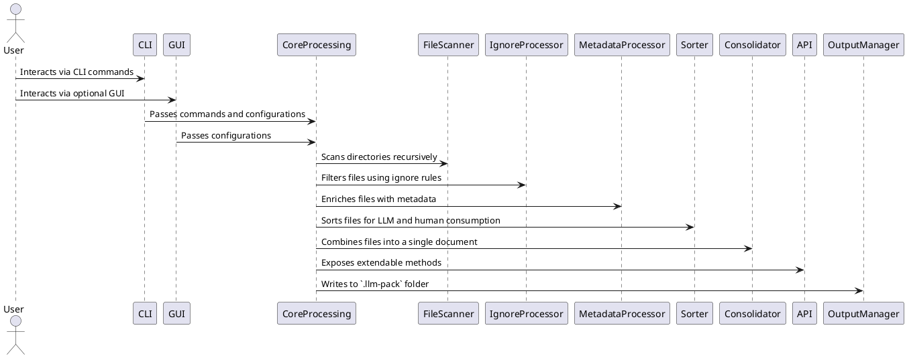

= SPEC: LLM-Pack
:sectnums:
:toc:

== Background

As developers and LLM users increasingly rely on generative AI tools to assist in development, creating concise, comprehensive, and contextually rich data inputs becomes critical. Many large language models (LLMs) operate in environments where users cannot upload large datasets or numerous files directly. Instead, users must copy and paste relevant content manually, which is time-consuming, error-prone, and often results in loss of critical context.

LLM-Pack is a CLI tool, with an optional GUI launched from the CLI, designed to address this challenge. It optimizes project files and datasets for consumption by LLMs and humans alike. By consolidating content into a single, labeled, and sorted file with metadata and interconnectivity details, LLM-Pack streamlines workflows, enhances LLM responses, and saves time for developers.

The tool respects existing project structure by adhering to ignore files, applies user-configured settings via `.llm-pack.config.json`, and outputs a `.llm-pack` folder with generated files and configurations. Its API-first design ensures high extendability and integrability across various platforms, fostering a robust ecosystem around the tool.

== Requirements

The LLM-Pack application must meet the following requirements to address the identified user needs effectively:

=== Must-Have

- **Recursive Indexing**: The tool must scan the entire project/dataset folder structure recursively, identifying all files and folders.
- **Ignore File Compliance**: Respect ignore files (`.gitignore`, `.llm-pack.ignore`, etc.) in the root or child directories during indexing.
- **File Consolidation**: Combine all non-ignored files into a single output file with:
  - Stylized headers containing file name, relative path, and metadata.
  - Relevant interconnectivity details for LLM optimization.
- **Sorting Mechanism**: Sort files in a manner optimized for both LLMs and humans.
- **Config File Support**: Parse `.llm-pack.config.json` files to customize the behavior and settings of the tool.
- **.llm-pack Folder Generation**: Output the consolidated file and associated configurations to the `.llm-pack` folder in the root directory.
- **CLI with Optional GUI**: Provide a command-line interface with an optional GUI for ease of use.
- **Extendable API**: Include a comprehensive API that allows easy integration with other systems or applications.

=== Should-Have

- **Metadata Enrichment**: Automatically generate additional metadata for files, such as descriptions or relationships, where applicable.
- **Interactive Mode**: Offer an interactive CLI mode for advanced configuration during execution.
- **Error Handling and Reporting**: Include robust error detection, logging, and user-friendly reporting.

=== Could-Have

- **Content Analysis**: Analyze file content for additional sorting and organization strategies (e.g., detecting similar themes or topics).
- **Language Agnostic**: Ensure compatibility with any file or folder structure regardless of content type or language.
- **GUI Customizations**: Allow GUI users to modify settings visually before execution.

=== Won’t-Have (for MVP)

- **Cloud Integration**: Direct integration with cloud services (e.g., S3, GDrive) is deferred for future versions.
- **Real-Time Syncing**: Automatic syncing with external datasets or repositories is out of scope for the initial implementation.
- **Workers and Web Workers**: Worker threads, including Web Workers for concurrency, will not be supported in the MVP version.

== Method

The architecture of LLM-Pack is designed to be modular, scalable, and extendable, with clear separation of concerns between its core functionalities. The following sections outline the major components and their interactions.

=== High-Level Architecture

The application consists of the following layers:
1. **CLI and GUI Layer**: Provides user interaction and configuration.
2. **Core Processing Layer**: Handles file scanning, ignore file compliance, metadata enrichment, and consolidation logic.
3. **API Layer**: Exposes extendable functionality for integrations.
4. **Output Layer**: Generates the `.llm-pack` folder and consolidated file.

Below is a high-level diagram of the architecture:



=== Key Modules

1. **File Scanner**
   - Recursively scans the root directory and subdirectories.
   - Gathers all file paths and metadata for processing.
   - Supports multithreaded scanning for performance optimization.

2. **Ignore Processor**
   - Parses `.gitignore`, `.llm-pack.ignore`, and other ignore files.
   - Filters out files and folders based on ignore rules.

3. **Metadata Processor**
   - Enriches each file with:
     - Relative path from the root.
     - Stylized headers with file names.
     - Interconnectivity details based on file relationships (e.g., imports, references).

4. **Sorter**
   - Implements sorting logic to arrange files in a meaningful order for both humans and LLMs.

5. **Consolidator**
   - Reads content from each file.
   - Applies stylized headers and integrates metadata.
   - Outputs a single file in **Markdown format** containing consolidated data.

6. **Config Processor**
   - Parses `.llm-pack.config.json` to customize application behavior.
   - Allows users to override default sorting, metadata, or file-processing rules.

7. **API**
   - Offers programmatic access to file indexing, metadata enrichment, and consolidation.
   - Supports integrations with external systems.

8. **GUI**
   - A lightweight interface launched from the CLI.
   - Provides visual customization of settings and triggers CLI commands.

=== File Structure

- **Input**: The tool expects to be run in the root directory of the project or dataset.
- **Output**: All results are stored in a `.llm-pack` folder with the following structure:
  ```
  .llm-pack/
  ├── consolidated_output.md    # Single consolidated Markdown file
  ├── config.json               # Copy of .llm-pack.config.json with defaults
  └── logs/                     # Logs for error handling and debugging
  ```

=== Algorithms

1. **Recursive File Scanning Algorithm**
   - Traverse directories using a Depth-First Search (DFS) or Breadth-First Search (BFS).
   - Skip ignored files and directories during traversal.

2. **File Consolidation Algorithm**
   - For each non-ignored file:
     1. Add a stylized header containing metadata.
     2. Append file content below the header in Markdown format.
   - Sort the files based on LLM optimization logic.

3. **Metadata Enrichment Logic**
   - Extract relationships using simple heuristics (e.g., `import` statements, file references).

=== Project File List

Below is the comprehensive list of all files required to build the project, including short descriptions, their contained features/methods, and any specific requirements.

```
src/
├── index.js
│   - Entry point of the application. Initializes CLI and GUI.
│   - Features:
│       - Command-line argument parsing.
│       - GUI initialization logic.
│   - Requirements:
│       - Access to CLI parser and GUI launcher modules.
│
├── cli/
│   ├── cli.js
│   │   - CLI interface logic.
│   │   - Features:
│   │       - Processes CLI arguments.
│   │       - Triggers core methods based on user input.
│   │   - Requirements:
│   │       - Core processing modules (scanner, consolidator, sorter).
│   │
│   └── interactive.js
│       - Interactive CLI mode logic.
│       - Features:
│           - Prompts users for inputs interactively.
│           - Displays options for customization.
│       - Requirements:
│           - Access to core modules and configuration processor.
│
├── gui/
│   ├── gui.js
│   │   - GUI entry point.
│   │   - Features:
│   │       - Renders GUI for user configuration and execution.
│   │       - Handles user interactions for running the tool visually.
│   │   - Requirements:
│   │       - Framework: Electron.js (or similar lightweight desktop app framework).
│   │       - Access to core modules for running logic.
│   │
│   ├── components/
│   │   ├── configEditor.js
│   │   │   - Component for editing configurations via GUI.
│   │   ├── filePreview.js
│   │   │   - Displays previews of scanned files in GUI.
│   │   └── logViewer.js
│   │       - Displays logs and errors in GUI.
│   │
├── core/
│   ├── fileScanner.js
│   │   - Recursively scans project directories.
│   │   - Features:
│   │       - Depth-First Search (DFS) algorithm.
│   │       - Multithreading for large directories.
│   │   - Requirements:
│   │       - Access to Node.js `fs` module.
│   │
│   ├── ignoreProcessor.js
│   │   - Processes ignore rules.
│   │   - Features:
│   │       - Parses `.gitignore` and `.llm-pack.ignore`.
│   │       - Filters ignored files and folders.
│   │   - Requirements:
│   │       - Support for parsing ignore file formats.
│   │
│   ├── metadataProcessor.js
│   │   - Adds metadata to files.
│   │   - Features:
│   │       - Extracts relative paths, descriptions, and interconnectivity.
│   │   - Requirements:
│   │       - Content parsing for metadata extraction (e.g., regex for `import` statements).
│   │
│   ├── consolidator.js
│   │   - Consolidates files into a single Markdown document.
│   │   - Features:
│   │       - Stylized headers with metadata.
│   │       - Appends file content below headers.
│   │   - Requirements:
│   │       - Access to metadata processor and sorted file list.
│   │
│   ├── sorter.js
│   │   - Sorts files for LLM optimization.
│   │   - Features:
│   │       - Rule-based sorting algorithms.
│   │       - Prioritizes entry-point files.
│   │   - Requirements:
│   │       - Configurable sorting rules.
│   │
│   └── configProcessor.js
│       - Processes `.llm-pack.config.json`.
│       - Features:
│           - Loads and validates configuration.
│           - Applies user-defined settings.
│       - Requirements:
│           - JSON parsing support.
│
├── api/
│   ├── api.js
│   │   - Exposes programmatic access to LLM-Pack functionality.
│   │   - Features:
│   │       - Methods for indexing, metadata enrichment, and consolidation.
│   │   - Requirements:
│   │       - Full access to core modules.
│   │
│   └── docs/
│       ├── api_reference.md
│       │   - Documentation for the API endpoints.
│       └── usage_examples.md
│           - Code examples for API integration.
│
├── output/
│   ├── outputManager.js
│   │   - Manages the `.llm-pack` folder and its contents.
│   │   - Features:
│   │       - Writes consolidated file in Markdown format.
│   │       - Generates logs and configuration snapshots.
│   │   - Requirements:
│   │       - File write access to the project directory.
│
├── utils/
│   ├── logger.js
│   │   - Logging utility.
│   │   - Features:
│   │       - Outputs logs for debugging and error tracking.
│   │
│   └── helpers.js
│       - Miscellaneous helper functions.
│
├── tests/
│   - Directory containing unit and integration tests for all modules.
│   - Features:
│       - Tests for each module, mock file systems for testing.
│   - Requirements:
│       - `Jest` or `Mocha` testing framework.
│
├── docs/
│   - Documentation directory.
│   - Features:
│       - User and developer guides, API documentation.
│   - Requirements:
│       - Markdown files, Swagger for API docs.
│
├── package.json
│   - Defines project dependencies and scripts.
│   - Features:
│       - Dependencies management, CLI and build scripts.
│   - Requirements:
│       - Required for npm.
│
├── .gitignore
│   - Excludes unnecessary files from version control.
│   - Features:
│       - Standard ignore rules.
│
├── .llm-pack.ignore
│   - Custom ignore file for LLM-Pack operations.
│   - Features:
│       - User-defined file and folder exclusions.
│
└── README.md
    - Main project readme for user introduction and installation instructions.
    - Features:
    │   - Overview, installation, usage examples.
```

=== Example Consolidated File Output

Below is an example snippet of a consolidated Markdown file:

```markdown
# main.js
**Path**: /src/main.js
**Metadata**: Entry point of the application
---

```javascript
console.log('Hello, World!');
```

---

# utils.js
**Path**: /src/helpers/utils.js
**Metadata**: Contains utility functions
---

```javascript
export const add = (a, b) => a + b;
```
```

== Implementation

This section provides a step-by-step implementation plan for LLM-Pack, including a comprehensive project file list.

=== Steps to Build

1. **Setup Project Structure**
   - Initialize the project with a directory structure for core modules, configuration, and output.
   - Use Node.js as the primary backend with ES modules (ECMAScript) for better modularity.

2. **Develop Core Modules**
   - Build each module incrementally, starting with FileScanner and IgnoreProcessor.

3. **Implement CLI**
   - Use a library like `commander` to create an intuitive command-line interface.

4. **Create Optional GUI**
   - Use a lightweight JavaScript framework (e.g., Electron or Tauri) to develop the GUI launched from the CLI.

5. **Design and Expose API**
   - Provide well-documented APIs using tools like Swagger or Postman.

6. **Test and Debug**
   - Write unit and integration tests for each module.
   - Use Jest or Mocha for testing the Node.js backend.

7. **Finalize Output Formatting**
   - Implement Markdown formatting for the consolidated output.
   - Ensure headers, metadata, and file contents are visually clear.

8. **Package and Distribute**
   - Create an npm package for easy installation.
   - Include comprehensive documentation for users and developers.

=== Project File List

Below is the list of all the files required for the project, along with descriptions, features, methods, and each file's requirements:

| **File**                | **Description**                                                                 | **Features and Methods**                                         | **Dependencies/Requirements**               |
|-------------------------|---------------------------------------------------------------------------------|-------------------------------------------------------------------|---------------------------------------------|
| `index.js`              | Entry point for the CLI and orchestrator.                                        | CLI command parser, orchestrator for core modules.               | Requires all core modules.                  |
| `cli.js`                | Handles user input and command-line interface.                                  | Parses arguments, calls appropriate functions.                   | `commander` or equivalent CLI library.      |
| `gui.js`                | Launches the optional GUI interface.                                            | Initializes GUI, passes configuration to the core.               | Electron or Tauri setup.                    |
| `FileScanner.js`        | Recursively scans the directory for files and folders.                          | DFS/BFS algorithms, returns file list and metadata.              | Core Node.js filesystem (`fs`) module.      |
| `IgnoreProcessor.js`    | Parses ignore files and filters out excluded files.                             | Reads `.gitignore`, `.llm-pack.ignore`, and similar files.        | `ignore` npm package.                       |
| `MetadataProcessor.js`  | Enriches files with metadata and interconnectivity details.                     | Extracts paths, relationships, and descriptions.                 | Regex parsers for relationship detection.   |
| `Sorter.js`             | Sorts files for human and LLM readability.                                      | Implements custom sorting algorithms.                            | Internal dependencies (MetadataProcessor).  |
| `Consolidator.js`       | Combines files into a single Markdown document with stylized headers.           | Reads files, applies formatting, writes to output.               | Uses Node.js streams for performance.       |
| `ConfigProcessor.js`    | Parses `.llm-pack.config.json` to customize app behavior.                       | Reads and validates configuration settings.                      | JSON parser, error handling.                |
| `OutputManager.js`      | Manages `.llm-pack` folder creation and writes consolidated output.             | Handles file output operations, ensures consistency.             | Node.js `fs` module.                        |
| `tests/`                | Directory containing unit and integration tests for all modules.                | Tests for each module, mock file systems for testing.            | `Jest` or `Mocha` testing framework.        |
| `docs/`                 | Documentation directory.                                                        | User and developer guides, API documentation.                    | Markdown files, Swagger for API docs.       |
| `package.json`          | Defines project dependencies and scripts.                                       | Dependencies management, CLI and build scripts.                  | Required for npm.                           |
| `.gitignore`            | Excludes unnecessary files from version control.                                | Standard ignore rules.                                           | None.                                       |
| `.llm-pack.ignore`      | Custom ignore file for LLM-Pack operations.                                     | User-defined file and folder exclusions.                         | None.                                       |
| `README.md`             | Main project readme for user introduction and installation instructions.         | Overview, installation, usage examples.                          | None.                                       |

=== Development Workflow

1. **Module Implementation Order**
   - Start with `FileScanner.js` and `IgnoreProcessor.js` as foundational modules.
   - Build `MetadataProcessor.js`, `Sorter.js`, and `Consolidator.js` sequentially.

2. **Testing Strategy**
   - Write unit tests for each module during development.
   - Test the entire workflow with mock datasets.

3. **Packaging**
   - Use npm to bundle the application for distribution.
   - Include a pre-launch script to validate configurations.

4. **Documentation**
   - Provide detailed documentation for CLI commands, API usage, and GUI interface.

5. **Deployment**
   - Publish the CLI tool on npm.
   - Bundle the GUI as an optional standalone installer.

== Milestones

The development of LLM-Pack will be divided into the following milestones to ensure incremental progress and iterative validation:

=== Milestone 1: Project Initialization
- **Deliverables**:
  - Set up the project structure, including directories for core modules, tests, and documentation.
  - Initialize `package.json` with project metadata and dependencies.
  - Create a `.gitignore` file and a sample `.llm-pack.ignore`.
  - Write a basic `README.md` with project overview and goals.
- **Estimated Completion**: Week 1

=== Milestone 2: Core Module Development - File Handling
- **Deliverables**:
  - Implement `FileScanner.js` for recursive file scanning.
  - Implement `IgnoreProcessor.js` for parsing and applying ignore rules.
  - Write unit tests for `FileScanner.js` and `IgnoreProcessor.js`.
- **Estimated Completion**: Week 2

=== Milestone 3: Metadata and Sorting Logic
- **Deliverables**:
  - Implement `MetadataProcessor.js` for metadata enrichment and interconnectivity detection.
  - Implement `Sorter.js` for sorting files based on LLM and human optimization logic.
  - Write unit tests for `MetadataProcessor.js` and `Sorter.js`.
- **Estimated Completion**: Week 4

=== Milestone 4: File Consolidation and Output
- **Deliverables**:
  - Implement `Consolidator.js` for combining files into a single Markdown document.
  - Implement `OutputManager.js` to handle `.llm-pack` folder creation and write outputs.
  - Write integration tests for the full consolidation workflow.
- **Estimated Completion**: Week 6

=== Milestone 5: Configuration and Extendability
- **Deliverables**:
  - Implement `ConfigProcessor.js` to parse `.llm-pack.config.json`.
  - Expose the API layer for integration with external systems.
  - Write API documentation in the `docs/` directory.
- **Estimated Completion**: Week 8

=== Milestone 6: CLI and GUI Development
- **Deliverables**:
  - Implement `cli.js` for the command-line interface using `commander`.
  - Develop `gui.js` using Electron or Tauri for optional GUI interface.
  - Write usage documentation for CLI and GUI in `README.md`.
- **Estimated Completion**: Week 10

=== Milestone 7: Testing and Documentation
- **Deliverables**:
  - Complete unit and integration tests for all modules.
  - Add mock datasets for testing the tool end-to-end.
  - Finalize user and developer documentation in the `docs/` directory.
- **Estimated Completion**: Week 12

=== Milestone 8: Packaging and Distribution
- **Deliverables**:
  - Package the CLI tool for npm distribution.
  - Bundle the GUI as an optional standalone installer.
  - Release version 1.0.0 on GitHub and npm.
- **Estimated Completion**: Week 14

=== Milestone 9: Feedback and Post-Launch Updates
- **Deliverables**:
  - Gather user feedback from early adopters.
  - Address critical bugs and improve documentation.
  - Plan for additional features based on user feedback.
- **Estimated Completion**: Week 16

== Gathering Results

To determine the success of LLM-Pack and its adherence to the specified requirements, the following evaluation steps will be performed:

=== Evaluation Metrics
1. **Functional Validation**:
   - Ensure all core features, such as recursive indexing, ignore file compliance, metadata enrichment, and output consolidation, work as intended.
   - Validate the accuracy and formatting of the Markdown output.

2. **Performance Metrics**:
   - Measure the time taken to process large datasets with different levels of complexity.
   - Assess memory and CPU usage during execution.

3. **User Feedback**:
   - Gather feedback from developers and LLM users on usability, performance, and output quality.
   - Evaluate the adoption and integration of the API in external systems.

4. **Error Handling**:
   - Confirm robust error reporting and logging for all edge cases.

=== Post-Production Updates
- Address issues identified during user testing.
- Incorporate user-requested features and enhancements.
- Plan for future releases with advanced features like real-time syncing and cloud integration.
```

---
