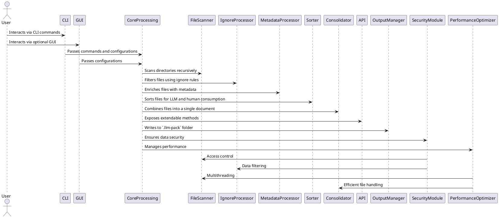

---

= SPEC: LLM-Pack
:sectnums:
:toc:

== Background

As developers and LLM users increasingly rely on generative AI tools to assist in development, creating concise, comprehensive, and contextually rich data inputs becomes critical. Many large language models (LLMs) operate in environments where users cannot upload large datasets or numerous files directly. Instead, users must copy and paste relevant content manually, which is time-consuming, error-prone, and often results in loss of critical context.

LLM-Pack is a CLI tool, with an optional GUI launched from the CLI, designed to address this challenge. It optimizes project files and datasets for consumption by LLMs and humans alike. By consolidating content into a single, labeled, and sorted file with metadata and interconnectivity details, LLM-Pack streamlines workflows, enhances LLM responses, and saves time for developers.

The tool respects existing project structure by adhering to ignore files, applies user-configured settings via `.llm-pack.config.json`, and outputs a `.llm-pack` folder with generated files and configurations. Its API-first design ensures high extendability and integrability across various platforms, fostering a robust ecosystem around the tool.

== Requirements

The LLM-Pack application must meet the following requirements to address the identified user needs effectively:

=== Must-Have

- **Recursive Indexing**: The tool must scan the entire project/dataset folder structure recursively, identifying all files and folders.
- **Ignore File Compliance**: Respect ignore files (`.gitignore`, `.llm-pack.ignore`, etc.) in the root or child directories during indexing.
- **File Consolidation**: Combine all non-ignored files into a single output file with:
  - Stylized headers containing file name, relative path, and metadata.
  - Relevant interconnectivity details for LLM optimization.
- **Sorting Mechanism**: Sort files in a manner optimized for both LLMs and humans.
- **Config File Support**: Parse `.llm-pack.config.json` files to customize the behavior and settings of the tool.
- **.llm-pack Folder Generation**: Output the consolidated file and associated configurations to the `.llm-pack` folder in the root directory.
- **CLI with Optional GUI**: Provide a command-line interface with an optional GUI for ease of use.
- **Extendable API**: Include a comprehensive API that allows easy integration with other systems or applications.
- **Security Compliance**: Ensure that sensitive data is handled securely and that the tool does not expose or leak confidential information.
- **Performance Efficiency**: Optimize the tool to handle large projects with minimal memory and CPU usage.

=== Should-Have

- **Metadata Enrichment**: Automatically generate additional metadata for files, such as descriptions or relationships, where applicable.
- **Interactive Mode**: Offer an interactive CLI mode for advanced configuration during execution.
- **Error Handling and Reporting**: Include robust error detection, logging, and user-friendly reporting.
- **Internationalization (i18n)**: Support multiple languages for the GUI and CLI to cater to a global user base.

=== Could-Have

- **Content Analysis**: Analyze file content for additional sorting and organization strategies (e.g., detecting similar themes or topics).
- **Language Agnostic**: Ensure compatibility with any file or folder structure regardless of content type or language.
- **GUI Customizations**: Allow GUI users to modify settings visually before execution.
- **Plugin System**: Enable third-party plugins to extend the functionality of LLM-Pack.

=== Won’t-Have (for MVP)

- **Cloud Integration**: Direct integration with cloud services (e.g., S3, GDrive) is deferred for future versions.
- **Real-Time Syncing**: Automatic syncing with external datasets or repositories is out of scope for the initial implementation.
- **Workers and Web Workers**: Worker threads, including Web Workers for concurrency, will not be supported in the MVP version.

== Method

The architecture of LLM-Pack is designed to be modular, scalable, and extendable, with clear separation of concerns between its core functionalities. The following sections outline the major components and their interactions.

=== High-Level Architecture

The application consists of the following layers:
1. **CLI and GUI Layer**: Provides user interaction and configuration.
2. **Core Processing Layer**: Handles file scanning, ignore file compliance, metadata enrichment, and consolidation logic.
3. **API Layer**: Exposes extendable functionality for integrations.
4. **Output Layer**: Generates the `.llm-pack` folder and consolidated file.
5. **Security Layer**: Ensures secure handling of data and compliance with data protection standards.
6. **Performance Optimization Layer**: Manages performance-related aspects like multithreading and resource management.

Below is a high-level diagram of the architecture:



=== Key Modules

1. **File Scanner**
   - Recursively scans the root directory and subdirectories.
   - Gathers all file paths and metadata for processing.
   - Supports multithreaded scanning for performance optimization.

2. **Ignore Processor**
   - Parses `.gitignore`, `.llm-pack.ignore`, and other ignore files.
   - Filters out files and folders based on ignore rules.

3. **Metadata Processor**
   - Enriches each file with:
     - Relative path from the root.
     - Stylized headers with file names.
     - Interconnectivity details based on file relationships (e.g., imports, references).

4. **Sorter**
   - Implements sorting logic to arrange files in a meaningful order for both humans and LLMs.

5. **Consolidator**
   - Reads content from each file.
   - Applies stylized headers and integrates metadata.
   - Outputs a single file in **Markdown format** containing consolidated data.

6. **Config Processor**
   - Parses `.llm-pack.config.json` to customize application behavior.
   - Allows users to override default sorting, metadata, or file-processing rules.

7. **API**
   - Offers programmatic access to file indexing, metadata enrichment, and consolidation.
   - Supports integrations with external systems.

8. **GUI**
   - A lightweight interface launched from the CLI.
   - Provides visual customization of settings and triggers CLI commands.
   - **UI/UX Design**:
     - **Configuration Panel**: Allows users to adjust settings visually.
     - **File Preview Pane**: Shows previews of scanned files.
     - **Log Viewer**: Displays logs and errors.
     - **Progress Indicators**: Visual feedback during processing.

9. **Security Module**
   - Ensures secure handling of data.
   - Implements data encryption for sensitive information.
   - Enforces access controls and permissions.

10. **Performance Optimizer**
    - Manages multithreading and resource allocation.
    - Optimizes memory and CPU usage for large projects.

=== File Structure

- **Input**: The tool expects to be run in the root directory of the project or dataset.
- **Output**: All results are stored in a `.llm-pack` folder with the following structure:
  ```
  .llm-pack/
  ├── consolidated_output.md    # Single consolidated Markdown file
  ├── config.json               # Copy of .llm-pack.config.json with defaults
  ├── logs/                     # Logs for error handling and debugging
  │   ├── error.log
  │   └── access.log
  └── reports/                  # Reports on processing and performance
      └── summary_report.md
  ```

=== Algorithms

1. **Recursive File Scanning Algorithm**
   - Traverse directories using a Depth-First Search (DFS) or Breadth-First Search (BFS).
   - Skip ignored files and directories during traversal.

2. **File Consolidation Algorithm**
   - For each non-ignored file:
     1. Add a stylized header containing metadata.
     2. Append file content below the header in Markdown format.
   - Sort the files based on LLM optimization logic.

3. **Metadata Enrichment Logic**
   - Extract relationships using simple heuristics (e.g., `import` statements, file references).

=== Security Considerations

Ensuring the security and privacy of data processed by LLM-Pack is paramount. The following measures are implemented:

- **Data Privacy**: The tool does not transmit any data externally. All processing occurs locally on the user's machine.
- **Sensitive Data Handling**: Implements encryption for any sensitive metadata or content included in the consolidated output.
- **Access Controls**: Restricts access to the `.llm-pack` folder to authorized users only.
- **Dependency Security**: Regularly scans and updates dependencies to mitigate vulnerabilities using tools like `npm audit`.

=== Performance Considerations

LLM-Pack is optimized to handle large projects efficiently. Key performance strategies include:

- **Multithreading**: Utilizes multithreading in the File Scanner to expedite directory traversal.
- **Efficient I/O Operations**: Implements buffered I/O to reduce read/write times during file consolidation.
- **Memory Management**: Employs streaming techniques to handle large files without excessive memory consumption.
- **Benchmarking**: Establishes performance benchmarks to ensure processing times remain within acceptable limits.

=== Dependency Management

Effective dependency management ensures the stability and security of LLM-Pack. Strategies include:

- **Version Pinning**: Specifies exact versions of dependencies in `package.json` to prevent unexpected updates.
- **Regular Updates**: Periodically updates dependencies to incorporate security patches and feature enhancements.
- **Vulnerability Scanning**: Integrates tools like `npm audit` to detect and address vulnerabilities.
- **Minimal Dependencies**: Keeps the dependency list minimal to reduce potential security risks and maintenance overhead.

=== Licensing

LLM-Pack will be released under the **MIT License**, providing users with flexibility while protecting the project's integrity. The `LICENSE` file in the project root will contain the full license text.

== Method

The architecture of LLM-Pack is designed to be modular, scalable, and extendable, with clear separation of concerns between its core functionalities. The following sections outline the major components and their interactions.

=== High-Level Architecture

The application consists of the following layers:
1. **CLI and GUI Layer**: Provides user interaction and configuration.
2. **Core Processing Layer**: Handles file scanning, ignore file compliance, metadata enrichment, and consolidation logic.
3. **API Layer**: Exposes extendable functionality for integrations.
4. **Output Layer**: Generates the `.llm-pack` folder and consolidated file.
5. **Security Layer**: Ensures secure handling of data and compliance with data protection standards.
6. **Performance Optimization Layer**: Manages performance-related aspects like multithreading and resource management.

Below is a high-level diagram of the architecture:


=== Key Modules

1. **File Scanner**
   - Recursively scans the root directory and subdirectories.
   - Gathers all file paths and metadata for processing.
   - Supports multithreaded scanning for performance optimization.
   - **Features**:
     - Depth-First Search (DFS) and Breadth-First Search (BFS) algorithms.
     - Concurrent processing for large directories.
   - **Requirements**:
     - Access to Node.js `fs` module.
     - Integration with Performance Optimizer for multithreading.

2. **Ignore Processor**
   - Parses `.gitignore`, `.llm-pack.ignore`, and other ignore files.
   - Filters out files and folders based on ignore rules.
   - **Features**:
     - Reads multiple ignore file formats.
     - Applies ignore patterns recursively.
   - **Requirements**:
     - `ignore` npm package or equivalent.
     - Efficient pattern matching algorithms.

3. **Metadata Processor**
   - Enriches each file with:
     - Relative path from the root.
     - Stylized headers with file names.
     - Interconnectivity details based on file relationships (e.g., imports, references).
   - **Features**:
     - Extracts dependencies and references.
     - Generates descriptive metadata.
   - **Requirements**:
     - Content parsing for metadata extraction (e.g., regex for `import` statements).
     - Integration with Sorter for relationship-based sorting.

4. **Sorter**
   - Implements sorting logic to arrange files in a meaningful order for both humans and LLMs.
   - **Features**:
     - Rule-based sorting algorithms.
     - Prioritizes entry-point files.
     - Supports custom sorting rules via configuration.
   - **Requirements**:
     - Configurable sorting rules.
     - Integration with Metadata Processor for informed sorting.

5. **Consolidator**
   - Reads content from each file.
   - Applies stylized headers and integrates metadata.
   - Outputs a single file in **Markdown format** containing consolidated data.
   - **Features**:
     - Reads and writes files efficiently using streams.
     - Ensures proper Markdown formatting.
   - **Requirements**:
     - Access to metadata processor and sorted file list.
     - Integration with Performance Optimizer for efficient file handling.

6. **Config Processor**
   - Parses `.llm-pack.config.json` to customize application behavior.
   - Allows users to override default sorting, metadata, or file-processing rules.
   - **Features**:
     - Loads and validates configuration settings.
     - Applies user-defined settings.
   - **Requirements**:
     - JSON parsing support.
     - Error handling for invalid configurations.

7. **API**
   - Offers programmatic access to file indexing, metadata enrichment, and consolidation.
   - Supports integrations with external systems.
   - **Features**:
     - Methods for indexing, metadata enrichment, and consolidation.
     - RESTful API endpoints.
     - Detailed API documentation.
   - **Requirements**:
     - Full access to core modules.
     - Security measures for API access (e.g., API keys).

8. **GUI**
   - A lightweight interface launched from the CLI.
   - Provides visual customization of settings and triggers CLI commands.
   - **UI/UX Design**:
     - **Configuration Panel**: Allows users to adjust settings visually.
     - **File Preview Pane**: Shows previews of scanned files.
     - **Log Viewer**: Displays logs and errors.
     - **Progress Indicators**: Visual feedback during processing.
   - **Features**:
     - Renders GUI for user configuration and execution.
     - Handles user interactions for running the tool visually.
   - **Requirements**:
     - Framework: Electron.js (or similar lightweight desktop app framework).
     - Access to core modules for running logic.

9. **Security Module**
   - Ensures secure handling of data.
   - Implements data encryption for sensitive information.
   - Enforces access controls and permissions.
   - **Features**:
     - Data encryption and decryption mechanisms.
     - Access control policies.
   - **Requirements**:
     - Integration with FileScanner and IgnoreProcessor for data protection.
     - Compliance with data protection standards (e.g., GDPR).

10. **Performance Optimizer**
    - Manages multithreading and resource allocation.
    - Optimizes memory and CPU usage for large projects.
    - **Features**:
      - Efficient scheduling of threads.
      - Resource monitoring and management.
    - **Requirements**:
      - Integration with FileScanner and Consolidator.
      - Performance benchmarking tools.

=== File Structure

- **Input**: The tool expects to be run in the root directory of the project or dataset.
- **Output**: All results are stored in a `.llm-pack` folder with the following structure:
  ```
  .llm-pack/
  ├── consolidated_output.md    # Single consolidated Markdown file
  ├── config.json               # Copy of .llm-pack.config.json with defaults
  ├── logs/                     # Logs for error handling and debugging
  │   ├── error.log
  │   └── access.log
  └── reports/                  # Reports on processing and performance
      └── summary_report.md
  ```

=== Algorithms

1. **Recursive File Scanning Algorithm**
   - Traverse directories using a Depth-First Search (DFS) or Breadth-First Search (BFS).
   - Skip ignored files and directories during traversal.

2. **File Consolidation Algorithm**
   - For each non-ignored file:
     1. Add a stylized header containing metadata.
     2. Append file content below the header in Markdown format.
   - Sort the files based on LLM optimization logic.

3. **Metadata Enrichment Logic**
   - Extract relationships using simple heuristics (e.g., `import` statements, file references).

=== Project File List

Below is the comprehensive list of all files required to build the project, including short descriptions, their contained features/methods, and any specific requirements.

```
src/
├── index.js
│   - Entry point of the application. Initializes CLI and GUI.
│   - Features:
│       - Command-line argument parsing.
│       - GUI initialization logic.
│   - Requirements:
│       - Access to CLI parser and GUI launcher modules.
│
├── cli/
│   ├── cli.js
│   │   - CLI interface logic.
│   │   - Features:
│   │       - Processes CLI arguments.
│   │       - Triggers core methods based on user input.
│   │   - Requirements:
│   │       - Core processing modules (scanner, consolidator, sorter).
│   │
│   └── interactive.js
│       - Interactive CLI mode logic.
│       - Features:
│           - Prompts users for inputs interactively.
│           - Displays options for customization.
│       - Requirements:
│           - Access to core modules and configuration processor.
│
├── gui/
│   ├── gui.js
│   │   - GUI entry point.
│   │   - Features:
│   │       - Renders GUI for user configuration and execution.
│   │       - Handles user interactions for running the tool visually.
│   │       - **UI/UX Design**:
│   │           - Configuration Panel
│   │           - File Preview Pane
│   │           - Log Viewer
│   │           - Progress Indicators
│   │   - Requirements:
│   │       - Framework: Electron.js (or similar lightweight desktop app framework).
│   │       - Access to core modules for running logic.
│   │
│   ├── components/
│   │   ├── configEditor.js
│   │   │   - Component for editing configurations via GUI.
│   │   ├── filePreview.js
│   │   │   - Displays previews of scanned files in GUI.
│   │   └── logViewer.js
│   │       - Displays logs and errors in GUI.
│   │
├── core/
│   ├── fileScanner.js
│   │   - Recursively scans project directories.
│   │   - Features:
│   │       - Depth-First Search (DFS) algorithm.
│   │       - Multithreading for large directories.
│   │   - Requirements:
│   │       - Access to Node.js `fs` module.
│   │       - Integration with Performance Optimizer.
│   │
│   ├── ignoreProcessor.js
│   │   - Processes ignore rules.
│   │   - Features:
│   │       - Parses `.gitignore` and `.llm-pack.ignore`.
│   │       - Filters ignored files and folders.
│   │   - Requirements:
│   │       - `ignore` npm package.
│   │
│   ├── metadataProcessor.js
│   │   - Adds metadata to files.
│   │   - Features:
│   │       - Extracts relative paths, descriptions, and interconnectivity.
│   │   - Requirements:
│   │       - Content parsing for metadata extraction (e.g., regex for `import` statements).
│   │
│   ├── consolidator.js
│   │   - Consolidates files into a single Markdown document.
│   │   - Features:
│   │       - Stylized headers with metadata.
│   │       - Appends file content below headers.
│   │       - Uses Node.js streams for performance.
│   │   - Requirements:
│   │       - Access to metadata processor and sorted file list.
│   │
│   ├── sorter.js
│   │   - Sorts files for LLM optimization.
│   │   - Features:
│   │       - Rule-based sorting algorithms.
│   │       - Prioritizes entry-point files.
│   │       - Supports custom sorting rules via configuration.
│   │   - Requirements:
│   │       - Configurable sorting rules.
│   │
│   └── configProcessor.js
│       - Processes `.llm-pack.config.json`.
│       - Features:
│           - Loads and validates configuration.
│           - Applies user-defined settings.
│       - Requirements:
│           - JSON parsing support.
│           - Error handling for invalid configurations.
│
├── api/
│   ├── api.js
│   │   - Exposes programmatic access to LLM-Pack functionality.
│   │   - Features:
│   │       - Methods for indexing, metadata enrichment, and consolidation.
│   │       - RESTful API endpoints.
│   │   - Requirements:
│   │       - Full access to core modules.
│   │       - Security measures for API access (e.g., API keys).
│   │
│   └── docs/
│       ├── api_reference.md
│       │   - Documentation for the API endpoints.
│       │   - **Includes**:
│       │       - Endpoint descriptions.
│       │       - Request and response formats.
│       │       - Authentication methods.
│       └── usage_examples.md
│           - Code examples for API integration.
│
├── output/
│   ├── outputManager.js
│   │   - Manages the `.llm-pack` folder and its contents.
│   │   - Features:
│   │       - Writes consolidated file in Markdown format.
│   │       - Generates logs and configuration snapshots.
│   │       - Creates summary reports on processing and performance.
│   │   - Requirements:
│   │       - File write access to the project directory.
│   │
├── utils/
│   ├── logger.js
│   │   - Logging utility.
│   │   - Features:
│   │       - Outputs logs for debugging and error tracking.
│   │       - Supports different log levels (info, warning, error).
│   │
│   └── helpers.js
│       - Miscellaneous helper functions.
│       - Features:
│           - Utility functions for common tasks.
│           - Data validation and formatting helpers.
│
├── tests/
│   ├── unit/
│   │   ├── fileScanner.test.js
│   │   ├── ignoreProcessor.test.js
│   │   ├── metadataProcessor.test.js
│   │   ├── sorter.test.js
│   │   └── consolidator.test.js
│   ├── integration/
│   │   ├── cliIntegration.test.js
│   │   ├── guiIntegration.test.js
│   │   └── apiIntegration.test.js
│   │
│   └── mocks/
│       ├── mockFileSystem.js
│       └── mockConfig.json
│       - Features:
│           - Mock file systems for testing.
│           - Sample configuration files for testing purposes.
│   - Features:
│       - Tests for each module, mock file systems for testing.
│   - Requirements:
│       - `Jest` or `Mocha` testing framework.
│
├── docs/
│   ├── user_guide.md
│   │   - Comprehensive guide for end-users.
│   │   - **Includes**:
│   │       - Installation instructions.
│   │       - CLI usage examples.
│   │       - GUI walkthrough.
│   │       - Troubleshooting tips.
│   ├── developer_guide.md
│   │   - Guide for developers contributing to the project.
│   │   - **Includes**:
│   │       - Codebase overview.
│   │       - Contribution guidelines.
│   │       - Coding standards.
│   ├── api/
│   │   ├── api_reference.md
│   │   │   - Documentation for the API endpoints.
│   │   └── usage_examples.md
│   │       - Code examples for API integration.
│   └── architecture_diagram.png
│       - Visual representation of the system architecture.
│
├── package.json
│   - Defines project dependencies and scripts.
│   - Features:
│       - Dependencies management, CLI and build scripts.
│       - Scripts for testing, building, and deploying.
│   - Requirements:
│       - Required for npm.
│
├── .gitignore
│   - Excludes unnecessary files from version control.
│   - Features:
│       - Standard ignore rules.
│
├── .llm-pack.ignore
│   - Custom ignore file for LLM-Pack operations.
│   - Features:
│       - User-defined file and folder exclusions.
│
├── README.md
│   - Main project readme for user introduction and installation instructions.
│   - Features:
│       - Overview, installation, usage examples.
│       - Links to detailed documentation.
│
├── LICENSE
│   - Licensing information for the project.
│   - Features:
│       - Full text of the MIT License.
│
└── CONTRIBUTING.md
    - Guidelines for contributing to the project.
    - Features:
    │   - Code of conduct.
    │   - Contribution process.
    │   - Development setup instructions.
```

=== Example Consolidated File Output

Below is an example snippet of a consolidated Markdown file:

```markdown
# main.js
**Path**: /src/main.js
**Metadata**: Entry point of the application
---
```javascript
console.log('Hello, World!');
```
---
# utils.js
**Path**: /src/helpers/utils.js
**Metadata**: Contains utility functions
---
```javascript
export const add = (a, b) => a + b;
```
```

== Implementation

This section provides a step-by-step implementation plan for LLM-Pack, including a comprehensive project file list.

=== Steps to Build

1. **Setup Project Structure**
   - Initialize the project with a directory structure for core modules, configuration, and output.
   - Use Node.js as the primary backend with ES modules (ECMAScript) for better modularity.

2. **Develop Core Modules**
   - Build each module incrementally, starting with FileScanner and IgnoreProcessor.
   - Implement the Security Module to handle data protection from the outset.

3. **Implement CLI**
   - Use a library like `commander` to create an intuitive command-line interface.
   - Ensure CLI supports both standard and interactive modes.

4. **Create Optional GUI**
   - Use a lightweight JavaScript framework (e.g., Electron or Tauri) to develop the GUI launched from the CLI.
   - Design the GUI with user-friendly components and clear navigation.

5. **Design and Expose API**
   - Provide well-documented APIs using tools like Swagger or Postman.
   - Ensure API endpoints are secure and efficiently handle requests.

6. **Integrate Security Measures**
   - Implement data encryption for sensitive information.
   - Set up access controls and authentication mechanisms for the API.

7. **Optimize Performance**
   - Implement multithreading in the File Scanner.
   - Optimize I/O operations in the Consolidator.
   - Conduct performance benchmarking and make necessary adjustments.

8. **Test and Debug**
   - Write unit and integration tests for each module.
   - Use Jest or Mocha for testing the Node.js backend.
   - Incorporate continuous integration (CI) tools for automated testing.

9. **Finalize Output Formatting**
   - Implement Markdown formatting for the consolidated output.
   - Ensure headers, metadata, and file contents are visually clear.

10. **Handle Dependency Management**
    - Pin dependency versions in `package.json`.
    - Set up automated dependency updates and vulnerability scanning.

11. **Documentation and Licensing**
    - Complete user and developer documentation in the `docs/` directory.
    - Add licensing information in the `LICENSE` file.

12. **Package and Distribute**
    - Create an npm package for easy installation.
    - Include comprehensive documentation for users and developers.
    - Bundle the GUI as an optional standalone installer.

13. **Deploy and Monitor**
    - Release version 1.0.0 on GitHub and npm.
    - Monitor for any issues and gather user feedback.

=== Project File List

Below is the list of all the files required for the project, along with descriptions, features, methods, and each file's requirements:

| **File**                | **Description**                                                                 | **Features and Methods**                                         | **Dependencies/Requirements**               |
|-------------------------|---------------------------------------------------------------------------------|-------------------------------------------------------------------|---------------------------------------------|
| `index.js`              | Entry point for the CLI and orchestrator.                                        | CLI command parser, orchestrator for core modules.               | Requires all core modules.                  |
| `cli.js`                | Handles user input and command-line interface.                                  | Parses arguments, calls appropriate functions.                   | `commander` or equivalent CLI library.      |
| `interactive.js`        | Manages interactive CLI mode.                                                   | Prompts user for inputs, configures settings interactively.      | `inquirer` or similar library.              |
| `gui.js`                | Launches the optional GUI interface.                                            | Initializes GUI, connects to core modules.                       | Electron or Tauri setup.                    |
| `fileScanner.js`        | Recursively scans the directory for files and folders.                          | DFS/BFS algorithms, returns file list and metadata.              | Core Node.js filesystem (`fs`) module.      |
| `ignoreProcessor.js`    | Parses ignore files and filters out excluded files.                             | Reads `.gitignore`, `.llm-pack.ignore`, and similar files.        | `ignore` npm package.                       |
| `metadataProcessor.js`  | Enriches files with metadata and interconnectivity details.                     | Extracts paths, relationships, and descriptions.                 | Regex parsers for relationship detection.   |
| `sorter.js`             | Sorts files for human and LLM readability.                                      | Implements custom sorting algorithms.                            | Internal dependencies (MetadataProcessor).  |
| `consolidator.js`       | Combines files into a single Markdown document with stylized headers.           | Reads files, applies formatting, writes to output.               | Uses Node.js streams for performance.       |
| `configProcessor.js`    | Parses `.llm-pack.config.json` to customize app behavior.                       | Reads and validates configuration settings.                      | JSON parser, error handling.                |
| `api.js`                | Exposes programmatic access to LLM-Pack functionality.                          | Methods for indexing, metadata enrichment, and consolidation.    | Full access to core modules.                |
| `outputManager.js`      | Manages `.llm-pack` folder creation and writes consolidated output.             | Handles file output operations, ensures consistency.             | Node.js `fs` module.                        |
| `logger.js`             | Logging utility.                                                                | Outputs logs for debugging and error tracking.                   | `winston` or similar logging library.       |
| `helpers.js`            | Miscellaneous helper functions.                                                 | Utility functions for common tasks.                              | None.                                       |
| `unit/*.test.js`        | Unit tests for individual modules.                                              | Tests for each core module.                                      | `Jest` or `Mocha` testing framework.        |
| `integration/*.test.js` | Integration tests for combined modules and workflows.                           | Tests CLI, GUI, and API integrations.                            | `Jest` or `Mocha` testing framework.        |
| `mocks/*.js`            | Mock data and configurations for testing.                                      | Mock file systems, sample configurations.                        | `mock-fs` or similar library.               |
| `user_guide.md`         | Comprehensive guide for end-users.                                              | Installation, CLI and GUI usage, troubleshooting.                | Markdown formatting.                        |
| `developer_guide.md`    | Guide for developers contributing to the project.                              | Codebase overview, contribution guidelines, coding standards.    | Markdown formatting.                        |
| `api_reference.md`      | Documentation for the API endpoints.                                           | Endpoint descriptions, request and response formats.             | Markdown formatting, Swagger integration.   |
| `usage_examples.md`     | Code examples for API integration.                                             | Sample code snippets and usage scenarios.                        | Markdown formatting.                        |
| `architecture_diagram.png` | Visual representation of the system architecture.                           | High-level architecture diagram.                                 | Diagram creation tool (e.g., PlantUML).     |
| `package.json`          | Defines project dependencies and scripts.                                       | Dependencies management, CLI and build scripts.                  | Required for npm.                           |
| `.gitignore`            | Excludes unnecessary files from version control.                                | Standard ignore rules.                                           | None.                                       |
| `.llm-pack.ignore`      | Custom ignore file for LLM-Pack operations.                                     | User-defined file and folder exclusions.                         | None.                                       |
| `README.md`             | Main project readme for user introduction and installation instructions.         | Overview, installation, usage examples, links to docs.           | None.                                       |
| `LICENSE`               | Licensing information for the project.                                         | Full text of the MIT License.                                    | None.                                       |
| `CONTRIBUTING.md`       | Guidelines for contributing to the project.                                    | Code of conduct, contribution process, development setup.        | Markdown formatting.                        |
```

=== Development Workflow

1. **Module Implementation Order**
   - Start with `FileScanner.js` and `IgnoreProcessor.js` as foundational modules.
   - Build `MetadataProcessor.js`, `Sorter.js`, and `Consolidator.js` sequentially.
   - Implement `SecurityModule.js` early to integrate security measures from the start.

2. **Testing Strategy**
   - Write unit tests for each module during development.
   - Develop integration tests for combined workflows.
   - Use continuous integration (CI) to automate testing processes.

3. **Dependency Management**
   - Pin dependency versions in `package.json`.
   - Set up automated tools for dependency updates and vulnerability scanning.

4. **Packaging**
   - Use npm to bundle the application for distribution.
   - Include a pre-launch script to validate configurations.

5. **Documentation**
   - Provide detailed documentation for CLI commands, API usage, and GUI interface.
   - Maintain up-to-date user and developer guides in the `docs/` directory.

6. **Build and Deployment Pipeline**
   - Set up CI/CD pipelines using tools like GitHub Actions or Travis CI.
   - Automate testing, building, and deployment processes.
   - Ensure that builds pass all tests before deployment.

7. **Licensing and Contribution Guidelines**
   - Finalize the `LICENSE` and `CONTRIBUTING.md` files.
   - Ensure that all contributors adhere to the code of conduct and contribution process.

8. **Finalize Output Formatting**
   - Implement Markdown formatting for the consolidated output.
   - Ensure headers, metadata, and file contents are visually clear.

9. **Performance Optimization**
   - Optimize multithreading and resource management based on benchmarking results.
   - Address any performance bottlenecks identified during testing.

10. **Security Audits**
    - Conduct security audits to identify and fix vulnerabilities.
    - Ensure compliance with data protection standards.

11. **Finalize and Release**
    - Conduct final testing and debugging.
    - Prepare release notes and documentation.
    - Release version 1.0.0 on GitHub and npm.

=== Roadmap for Future Enhancements

While the current specification focuses on the MVP, the following features are planned for future releases:

- **Cloud Integration**: Support for direct integration with cloud services like AWS S3 and Google Drive.
- **Real-Time Syncing**: Enable automatic syncing with external datasets or repositories.
- **Advanced Content Analysis**: Implement machine learning algorithms for deeper content analysis and organization.
- **Plugin System**: Allow third-party developers to create plugins to extend LLM-Pack’s functionality.
- **Enhanced GUI Features**: Introduce more customization options and advanced visualization tools.
- **Localization**: Support multiple languages in the GUI and CLI.
- **Mobile Support**: Develop mobile-friendly interfaces or companion apps.

== Milestones

The development of LLM-Pack will be divided into the following milestones to ensure incremental progress and iterative validation:

=== Milestone 1: Project Initialization
- **Deliverables**:
  - Set up the project structure, including directories for core modules, tests, and documentation.
  - Initialize `package.json` with project metadata and dependencies.
  - Create a `.gitignore` file and a sample `.llm-pack.ignore`.
  - Write a basic `README.md` with project overview and goals.
  - Add `LICENSE` and `CONTRIBUTING.md` files.
- **Estimated Completion**: Week 1

=== Milestone 2: Core Module Development - File Handling
- **Deliverables**:
  - Implement `FileScanner.js` for recursive file scanning.
  - Implement `IgnoreProcessor.js` for parsing and applying ignore rules.
  - Write unit tests for `FileScanner.js` and `IgnoreProcessor.js`.
  - Integrate `PerformanceOptimizer` with `FileScanner.js`.
- **Estimated Completion**: Week 2

=== Milestone 3: Metadata and Sorting Logic
- **Deliverables**:
  - Implement `MetadataProcessor.js` for metadata enrichment and interconnectivity detection.
  - Implement `Sorter.js` for sorting files based on LLM and human optimization logic.
  - Write unit tests for `MetadataProcessor.js` and `Sorter.js`.
- **Estimated Completion**: Week 4

=== Milestone 4: File Consolidation and Output
- **Deliverables**:
  - Implement `Consolidator.js` for combining files into a single Markdown document.
  - Implement `OutputManager.js` to handle `.llm-pack` folder creation and write outputs.
  - Write integration tests for the full consolidation workflow.
- **Estimated Completion**: Week 6

=== Milestone 5: Configuration and Extendability
- **Deliverables**:
  - Implement `ConfigProcessor.js` to parse `.llm-pack.config.json`.
  - Expose the API layer for integration with external systems.
  - Write API documentation in the `docs/` directory.
  - Implement basic API security measures.
- **Estimated Completion**: Week 8

=== Milestone 6: CLI and GUI Development
- **Deliverables**:
  - Implement `cli.js` for the command-line interface using `commander`.
  - Develop `gui.js` using Electron or Tauri for optional GUI interface.
  - Design and implement GUI components (Configuration Panel, File Preview Pane, Log Viewer, Progress Indicators).
  - Write usage documentation for CLI and GUI in `README.md`.
- **Estimated Completion**: Week 10

=== Milestone 7: Testing and Documentation
- **Deliverables**:
  - Complete unit and integration tests for all modules.
  - Add mock datasets for testing the tool end-to-end.
  - Finalize user and developer documentation in the `docs/` directory.
  - Conduct security audits and address vulnerabilities.
- **Estimated Completion**: Week 12

=== Milestone 8: Packaging and Distribution
- **Deliverables**:
  - Package the CLI tool for npm distribution.
  - Bundle the GUI as an optional standalone installer.
  - Release version 1.0.0 on GitHub and npm.
  - Set up CI/CD pipelines for automated testing and deployment.
- **Estimated Completion**: Week 14

=== Milestone 9: Feedback and Post-Launch Updates
- **Deliverables**:
  - Gather user feedback from early adopters.
  - Address critical bugs and improve documentation.
  - Plan for additional features based on user feedback.
  - Begin work on roadmap features like cloud integration.
- **Estimated Completion**: Week 16

== Gathering Results

To determine the success of LLM-Pack and its adherence to the specified requirements, the following evaluation steps will be performed:

=== Evaluation Metrics
1. **Functional Validation**:
   - Ensure all core features, such as recursive indexing, ignore file compliance, metadata enrichment, and output consolidation, work as intended.
   - Validate the accuracy and formatting of the Markdown output.

2. **Performance Metrics**:
   - Measure the time taken to process large datasets with different levels of complexity.
   - Assess memory and CPU usage during execution.
   - Ensure performance benchmarks are met as per the Performance Considerations.

3. **User Feedback**:
   - Gather feedback from developers and LLM users on usability, performance, and output quality.
   - Evaluate the adoption and integration of the API in external systems.

4. **Error Handling**:
   - Confirm robust error reporting and logging for all edge cases.
   - Ensure that logs provide sufficient detail for debugging.

5. **Security Audits**:
   - Verify that all security measures are effectively protecting data.
   - Ensure compliance with data protection standards (e.g., GDPR).

6. **API Usage**:
   - Monitor the usage and performance of the API endpoints.
   - Ensure that API documentation is clear and comprehensive.

=== Post-Production Updates
- Address issues identified during user testing.
- Incorporate user-requested features and enhancements.
- Plan for future releases with advanced features like real-time syncing and cloud integration.
- Continuously monitor and update dependencies to maintain security and performance.

=== Roadmap Evaluation
- Regularly assess progress against the roadmap for future enhancements.
- Prioritize roadmap features based on user demand and feasibility.

